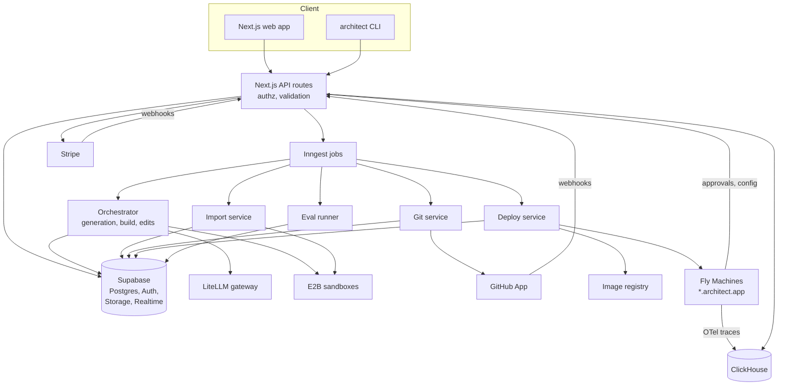
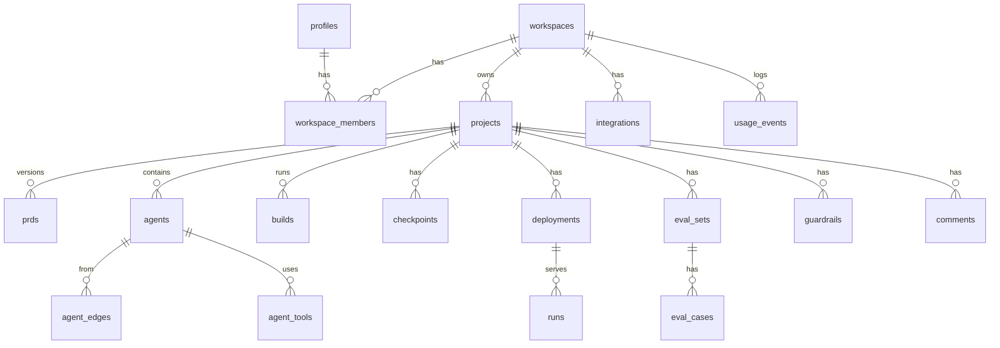
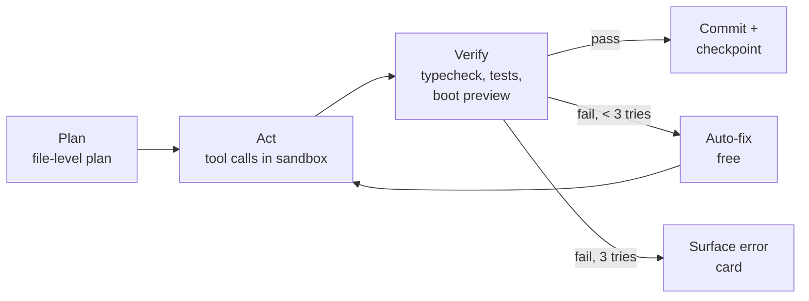

# Architect 2.0 — Engineering Document (High-Level Design)

| Field | Value |
|---|---|
| Status | Draft for approval — no implementation begins until approved |
| Version | 1.0 |
| Date | 2026-09-25 |
| Source PRD | Architect 2.0 — Product Requirements Document (Claude Doc `61e6d274-8984-47f9-ae03-e97835f689b1`) |
| Owner | Engineering, Lyzr |
| Frontend | Next.js 14 (App Router, TypeScript) — fixed |

PRD references use the PRD's IDs: `FR-xx` (functional requirements, PRD §15.2), `US-xx` (user stories, PRD §15.1), `Flow n` (PRD §6–14), NFR (PRD §16).

---

## 1. Executive Summary

**Project name:** Architect 2.0

**Business goal:** Grow Architect from a non-technical agent-app builder into one platform for both non-technical builders and developers. Targets (PRD §1): 30% of weekly active builders are developers, 25% of projects deployed, 40% of developer projects GitHub-connected, 15% of new projects imported, 5% free→paid conversion, all within 90 days of GA.

**Problem statement:** Teams building *agentic* applications must split work across app builders (no agent control, no code), coding agents (developer-only, no hosting or governance) and workflow tools (no UI). Architect v1 serves only non-technical users, so projects leave Architect when they need code, Git or a specific agent framework.

**Solution in one line:** A dual-mode workspace (**Build mode** for prompting and visual editing, **Code mode** for files, terminal, diffs and Git) on one project, backed by a sandbox runtime, framework-agnostic agent adapters, a GitHub App integration, a deploy pipeline and Agent Studio for production observability and governance.

**Target users:** Non-technical founder/PM (Priya), full-stack developer (Arjun), AI/ML engineer (Meera), enterprise admin (Rahul), agency builder (PRD §3.1).

**Engineering success criteria:**

| Criterion | Target | Source |
|---|---|---|
| Signup → first working agent preview | < 3 min P50 | PRD §1 |
| Clarifying questions after prompt | < 5 s | NFR |
| Template build to preview | < 4 min | NFR |
| Workspace open | < 3 s P95 | NFR |
| Hot reload | < 2 s | NFR |
| Canvas ↔ code sync | < 3 s | US-04 |
| Deploy to live URL | < 3 min | US-05 |
| Platform availability | 99.9% | NFR |
| Deployed prod apps availability | 99.95% | NFR |
| Template build success rate | ≥ 85% | NFR |
| Cost metering accuracy | within 1% | NFR |

**Prototype scope (PRD §17.3):** Authentication, onboarding, workspaces and project CRUD are **fully functional on Supabase**. Agent canvas edits persist to the database. All other flows (build, code mode, import, GitHub, deploy, Studio, integrations, billing) are clickable with seeded dummy data behind a `MOCK_MODE` flag, using the same API contracts as the real implementation so mocks can be swapped out without frontend changes.

---

## 2. Product Scope

### 2.1 In scope (2.0)

| Area | Features | Priority | FRs |
|---|---|---|---|
| Identity | Email/password, Google, GitHub OAuth, email verification, password reset, onboarding | P0 | FR-01, FR-02 |
| Workspace | Workspaces, members, dashboard, project CRUD, search/filter | P0 | FR-03 |
| Generation | Prompt with attachments → clarifying questions → PRD → agent graph → cost estimate → build → preview → iterate | P0 (estimate P1) | FR-04–FR-11 |
| Build mode | Chat, preview, Agent Canvas, visual edits, checkpoints, locks | P0 | FR-06, FR-09–FR-11 |
| Code mode | File tree, Monaco editor, terminal, diffs, coding agent, problems/logs | P0 | FR-17, FR-18 |
| Parallel tasks + CLI | Branch-per-task agents, `architect` CLI | P1 | FR-19, FR-20 |
| Import | GitHub, zip (P0); v1, Lovable/Bolt/Replit exports, Lyzr Studio agents (P1) | P0/P1 | FR-12, FR-13 |
| Frameworks | Lyzr ADK, LangGraph, CrewAI, OpenAI Agents SDK (P0); per-agent framework/model, BYO keys (P1); conversion (P2) | P0–P2 | FR-14–FR-16 |
| GitHub | GitHub App, create/link repo, auto-commit, branches, PRs, webhook sync, PR previews | P0/P1 | FR-21, FR-22 |
| Deploy | Architect Cloud, pre-deploy checks, environments, secrets, domains + SSL, rollback | P0 | FR-23, FR-24 |
| Evals | Eval sets, scorers, runs, deploy gate | P1 | FR-25 |
| Agent Studio | Overview, traces, agents, guardrails, versions, alerts, HITL queue | P0/P1 | FR-26, FR-27 |
| Integrations | OAuth/API-key connectors, custom MCP servers | P1 | FR-28 |
| Collaboration | Invites, roles, comments, presence, activity | P1 | FR-29 |
| Templates | Gallery, "Use template" flow | P1 | FR-30 |
| Billing | Plans, Stripe Checkout, usage, spend caps | P1 | FR-31 |
| Generated-app backend | Managed Postgres, end-user auth, storage | P0 | FR-32 |

### 2.2 Out of scope (2.0)

- Native desktop IDE (developers use CLI + own IDE).
- Hosting on third-party clouds beyond export (Docker / Vercel etc. is P2, FR-34).
- Model training or fine-tuning.
- Template marketplace revenue share.

### 2.3 Future enhancements (Phase 3+)

- SSO/SAML, SCIM, audit log export, VPC / self-host (FR-33).
- Docker export and deploy to Vercel/AWS/GCP/Azure (FR-34).
- Framework conversion (FR-16); Google ADK, Claude Agent SDK, Mastra, AutoGen adapters.
- Real-time CRDT co-editing; VS Code/Cursor extension; Architect as an MCP server.
- Mobile (Expo) front ends; embeddable chat widget and REST endpoint per agent.
- A/B agent version splits; OpenTelemetry export and log drains; GitLab/Bitbucket.
- Regional data residency (US, EU, India).

---

## 3. User Personas

| Persona | Workspace role | Default mode | Responsibilities | Permissions | Primary workflows |
|---|---|---|---|---|---|
| Priya — non-technical founder/PM | owner or editor | Build | Define the app, review PRD and agents, deploy, watch results | Create/edit projects, canvas, prompts, deploy (if editor+), view Studio | Flow 1 → 2 → 7 → 8 |
| Arjun — full-stack developer | editor + `is_developer` | Code | Extend code, tests, PRs, environments | All editor rights + Code mode, terminal, secrets, Git ops | Flow 5 → 6 → 7 |
| Meera — AI/ML engineer | editor + `is_developer` | Code → Build | Import agents, choose frameworks/models, evals | As Arjun + framework/model settings, eval gates | Flow 3 → 4 → 7 (evals) → 8 |
| Rahul — enterprise admin | admin | Admin console | Govern usage and safety | Members/roles, guardrails, spend caps, Code-mode restriction, audit | Flow 8, Flow 12 |
| Agency builder | owner of many workspaces | Both | Build for clients | Owner rights per client workspace, custom domains | Flow 11 → 2 → 7 |
| Viewer (stakeholder) | viewer | Build (read-only) | Review and comment | Read projects, preview, Studio; comment | Flow 10 |

### 3.1 Permission matrix

| Action | owner | admin | editor | editor + developer | viewer |
|---|---|---|---|---|---|
| View project, preview, Studio | ✓ | ✓ | ✓ | ✓ | ✓ |
| Comment | ✓ | ✓ | ✓ | ✓ | ✓ |
| Prompt / canvas / visual edits | ✓ | ✓ | ✓ | ✓ | ✗ |
| Code mode, terminal, Git ops | ✓ | ✓ | ✗ when workspace `code_mode_restricted`, else ✓ | ✓ | ✗ |
| Manage secrets | ✓ | ✓ | ✗ | ✓ | ✗ |
| Deploy to preview | ✓ | ✓ | ✓ | ✓ | ✗ |
| Deploy to production / rollback | ✓ | ✓ | ✓ (if `prod_deploy_role` = editor) | ✓ | ✗ |
| Guardrails, alerts, HITL approver | ✓ | ✓ | ✗ | ✗ (unless assigned approver) | ✗ |
| Members, billing, spend caps | ✓ | ✓ (no billing) | ✗ | ✗ | ✗ |
| Delete project / workspace | ✓ | project only | ✗ | ✗ | ✗ |

Enforced twice: Postgres RLS (data access) and the `authorize()` API middleware (actions). See §6.2.

---

## 4. User Flows

Format: **User Action → Frontend Behavior → Backend Processing → Database Interaction → System Response**. `[MOCK]` marks steps that return seeded data in the prototype.

### 4.1 Flow 1 — Sign up, verify, onboard (FR-01, FR-02)

1. Types prompt on landing and submits → saves prompt to `sessionStorage['pending_prompt']`, opens auth modal → none → none → modal shown.
2. Clicks "Continue with Google/GitHub" → `supabase.auth.signInWithOAuth({provider, redirectTo:'/auth/callback'})` → Supabase OAuth; `/auth/callback` route exchanges code for session cookie → `auth.users` row created; trigger `handle_new_user()` inserts `profiles` row → redirect to `/onboarding`.
3. Email sign-up → `signUp({email,password})` → Supabase sends 6-digit OTP → `auth.users` (unconfirmed) → verify screen; `verifyOtp()` confirms → redirect `/onboarding`.
4. Answers Q1 (mode), Q2 (use case), Q3 (workspace name, invites), Q4 dev extras → local wizard state (Zustand), `POST /api/onboarding` on finish → validate with Zod; transaction → update `profiles(default_mode, use_case, preferred_framework, preferred_language, onboarded_at)`; insert `workspaces`, `workspace_members(role='owner')`; insert `invitations` → 201 `{workspaceId}`.
5. Finish → if `pending_prompt` exists, `POST /api/projects` with prompt then route to `/w/{ws}/p/{id}?step=clarify`; else `/w/{ws}` dashboard → project created (see 4.2) → workspace opens.
6. Log in → `signInWithPassword` / OAuth → session cookie; middleware refreshes token → `profiles.last_seen_at` update → redirect to last workspace.
7. Forgot password → `resetPasswordForEmail` → email link → `/auth/reset` `updateUser({password})` → `auth.users` updated → auto sign-in.

Edge cases: OAuth email already registered with password → Supabase identity linking prompt; invite link signed-out → `/invite/{token}` stores token, after auth `POST /api/invitations/{token}/accept` inserts membership and skips onboarding Q3.

### 4.2 Flow 1b — Dashboard and project CRUD (FR-03)

1. Opens `/w/{ws}` → RSC fetches projects server-side; TanStack Query hydrates → `GET /api/workspaces/{ws}/projects?filter=&q=` → `select` from `projects` with RLS → grid of cards.
2. Creates project (Build/Import/Template tab) → `POST /api/projects` → validate; check plan project limit → insert `projects(status='draft')` + `project_events` → 201, route to workspace.
3. Renames / deletes → `PATCH` / `DELETE /api/projects/{id}` → `authorize('project:update'|'project:delete')` → update / soft-delete (`deleted_at`) → optimistic UI update, toast with Undo (10 s).

### 4.3 Flow 2 — Prompt to agentic app (FR-04–FR-11)

1. Submits prompt + attachments → uploads files to Supabase Storage `project-attachments/{projectId}/`, then `POST /api/projects/{id}/generation/clarify` → Generation service builds context (prompt, attachments text extraction, profile use case) → calls LLM (fast model) with `clarify.v1` prompt returning JSON questions → insert `generation_sessions(stage='clarify', questions)` → questions rendered as chips (< 5 s). `[MOCK]` canned questions.
2. Answers or clicks "Skip" → `POST .../generation/prd` → LLM (reasoning model) `prd.v1` with answers → insert `prds(version=1, content)`; update session stage → PRD tab opens with editable sections.
3. Edits a PRD section → debounced `PATCH /api/prds/{id}` → validates JSON schema → new `prds` version row → saved indicator.
4. Clicks "Next: agents" → `POST .../generation/agent-graph` → LLM `agent_graph.v1` returns neutral graph JSON (`AgentGraph` schema §8.4) → insert `agents`, `agent_edges`, `agent_tools` → React Flow canvas rendered.
5. Drags/edits nodes → canvas store (Zustand) → `PATCH /api/projects/{id}/agents/{agentId}` / `POST .../edges` (debounced 500 ms) → upsert rows (functional in prototype) → autosave indicator.
6. Reaches Confirm → `POST .../generation/estimate` → Estimator computes credits from graph size, integrations, template similarity (§8.7) → none (cached in session) → shows "~52 credits · ~5 min" and missing integrations with Connect buttons.
7. Clicks "Build it" → `POST .../builds` → reserves credits (`credit_reservations`), enqueues `build.run` job → insert `builds(status='queued')` → 202 `{buildId}`; client subscribes to Realtime channel `build:{id}`.
8. Build runs → Orchestrator provisions sandbox, writes scaffold (Next.js app + agents via framework adapter + DB migrations), runs install, tests; emits step events → `build_events` rows + Realtime broadcast → checklist ticks live; Explorer shows files (Code mode). `[MOCK]` scripted events every 1.5 s.
9. Build completes → dev server started in sandbox; preview URL `https://{sandboxId}-3000.preview.architect.dev` → update `builds(status='succeeded')`, create `checkpoints` row with commit SHA; settle credits (`usage_events`) → Preview iframe loads; test console enabled.
10. Chats in test console → `POST /api/projects/{id}/test-runs` → proxies to sandbox agent runtime `/invoke`, collects trace → insert `runs(environment='dev')` → streamed reply with agent trace chips.
11. Iterates by chat → `POST .../edits` `{mode:'plan'|'build', message, lockedIds}` → coding agent plans or edits files in sandbox, respecting locks → `edits`, `checkpoints` rows → change card with summary and "Restore".
12. Visual edit (click element in preview) → iframe bridge (`postMessage`) reports `data-arch-id` + element; inspector edits → `POST .../visual-edits` → deterministic AST patch (no LLM, no credits) → checkpoint → preview hot-reloads < 2 s.
13. Restore checkpoint → `POST .../checkpoints/{id}/restore` → `git revert`/reset to SHA in sandbox → new checkpoint row → preview reloads.
14. Build failure → orchestrator auto-fix loop (max 3 retries, free) → `build_events(type='autofix')` → if still failing, red card with plain cause + "Fix it" (Build) or stack trace (Code).

### 4.4 Flow 3 — Import (FR-12, FR-13)

1. Chooses "Import from GitHub" → if no installation, opens GitHub App install popup → `GET /api/github/installations/{id}/repos` via Octokit installation token → `github_installations` row → repo/branch/sub-folder picker. `[MOCK]` sample repos.
2. Zip upload → direct upload to Storage `imports/{uuid}.zip` via signed URL (≤ 200 MB) → none → progress bar.
3. Confirms → `POST /api/imports` → enqueue `import.scan`: sandbox clones/unzips, runs Detector (§8.8) → insert `imports(status='scanning')`, then `import_reports(detected_stack, agents, missing_env, secrets_found, start_command)` → report screen.
4. Fills missing env vars / picks start command → `PATCH /api/imports/{id}` → store env names in `project_env_vars` (values encrypted in `secrets`) → report updates.
5. Clicks "Open in Build/Code mode" → `POST /api/imports/{id}/finalize` → create `projects`, write `architect.json` only, create branch `architect/import`, map detected agents to `agents` (`managed=false` for unmappable "Code agents") → workspace opens; first run in preview.

### 4.5 Flow 4 — Frameworks and models (FR-14, FR-15, FR-16)

1. Chooses framework on Confirm screen → `PATCH /api/projects/{id}` `{framework}` → validates against adapter registry → `projects.framework` → adapter used for build.
2. Sets per-agent runtime/model in inspector → `PATCH .../agents/{id}` `{framework, model}` → validates model allowed by plan and BYO keys → `agents` updated → node badge updates; next build regenerates that agent's managed region.
3. Adds BYO key → `POST /api/workspaces/{ws}/model-keys` → encrypt with KMS, validate with a 1-token test call → `secrets(kind='model_key')` → key shown masked.
4. (P2) "Convert project" → `POST .../conversions` → adapter compatibility check → `conversions` row + new branch → preview diff and checklist.

### 4.6 Flow 5 — Code mode (FR-17–FR-20)

1. Toggles `Build | Code` → route segment switch `/p/{id}/code`; `profiles.mode_prefs` updated → `GET .../files/tree` from sandbox FS → none → Explorer + Monaco render. `[MOCK]` static sample tree.
2. Opens/edits file → `GET/PUT .../files?path=` → sandbox FS read/write; if file in managed region, Sync service re-parses and updates canvas → `agents` updated when managed code changes → Realtime `project:{id}` event updates canvas for teammates.
3. Terminal → WebSocket `wss://.../sandboxes/{id}/pty` (xterm.js) → PTY in sandbox; commands audited → `terminal_sessions` → streamed output. `[MOCK]` scripted output.
4. Asks coding agent → `POST .../edits` `{mode, message, context:['@file:src/x.ts']}` → agent returns patch set; files not applied until accepted → `edits(status='proposed')` → diff viewer; Accept/Reject per hunk → `POST .../edits/{id}/apply {hunks}` → applied, checkpoint + commit.
5. Starts parallel task (P1) → `POST .../tasks` → new branch `architect/{slug}` in separate sandbox → `agent_tasks` → task list with status; each yields a diff/PR.
6. CLI (P1) → `architect login` (device-code OAuth) → `POST /api/cli/device-code`, poll `/api/cli/token` → `api_tokens` → `pull`/`push` use Git over HTTPS with token; `dev` pulls env via `GET .../env?environment=development`; `deploy` calls deploy API.

### 4.7 Flow 6 — GitHub (FR-21, FR-22)

1. Clicks "Connect GitHub" → popup to GitHub App install URL with `state` → GitHub redirects to `/api/github/callback` → verify state, store installation → `github_installations` → modal step 2.
2. Create new repo / link existing → `POST /api/projects/{id}/github` `{mode, owner, name, private}` → Octokit create repo (or verify access), push sandbox repo, set remote → `projects.repo_*` fields → status dot green.
3. Accepted change (auto-commit on) → Git service commits in sandbox with message from LLM (small model) and pushes to working branch → `checkpoints.commit_sha` → "Saved to GitHub".
4. External push → GitHub webhook `push` → `/api/webhooks/github` verifies HMAC, enqueues `git.pull` → sandbox pulls, Sync service re-syncs canvas, preview rebuild → `git_sync_events` → banner "3 new commits pulled".
5. Creates PR → `POST .../pull-requests` → Octokit create PR with AI summary; trigger preview deploy; post comment with URL → `pull_requests`, `deployments(environment='preview')` → PR link toast.
6. Conflict → pull fails with conflict → `git_sync_events(status='conflict')` → red status; Code mode shows 3-way resolver; Build mode shows "needs developer" with @mention.
7. Protected main → push rejected → Git service opens PR instead → PR link.

### 4.8 Flow 7 — Evals and deploy (FR-23, FR-24, FR-25)

1. Clicks Deploy → `POST /api/projects/{id}/deployments/preflight` → checks: required secrets present, build passes, eval score ≥ gate, security scan (secrets in code, tables without RLS) → none → checklist with Fix buttons.
2. Publishes → `POST .../deployments` `{environment}` → reserve slot, enqueue `deploy.run`: build OCI image (Nixpacks/Docker) from commit, push to registry, release to runtime (Fly Machines) with env + secrets, health check → `deployments(status: queued→building→releasing→live|failed)` + `deployment_events` → progress bar; live URL `https://{slug}.architect.app`, QR. `[MOCK]` row with fake URL and timed status transitions.
3. Health check fails → auto rollback to previous `live` version → `deployments.status='rolled_back'` → notification to deployer.
4. Rollback click → `POST .../deployments/{id}/rollback` → re-point router to previous image → new `deployments` row (`source='rollback'`) → toast.
5. Adds domain → `POST .../domains` → create DNS verification record; ACME cert (Caddy/Let's Encrypt) after verify → `domains(status: pending→verified→active)` → DNS instructions + status poller.
6. Manages secrets → `PUT .../secrets` → KMS encrypt; audit → `secrets`, `audit_logs` → masked values.
7. Creates eval set → upload CSV or "Generate 20 cases from PRD" → `POST .../evals/sets` → LLM generates cases from PRD → `eval_sets`, `eval_cases` → table.
8. Runs evals → `POST .../evals/runs` → queue runs each case against sandbox agent; scorers (§8.9) → `eval_runs`, `eval_results` → pass/fail table, diff vs last run; gate status.

### 4.9 Flow 8 — Agent Studio (FR-26, FR-27)

1. Opens Studio → `GET /api/projects/{id}/studio/overview?range=` → aggregates from ClickHouse `runs_rollup` (Postgres view in prototype) → KPI tiles + chart. `[MOCK]` seeded `runs`.
2. Opens a run → `GET .../runs/{runId}` → fetch trace spans → `runs`, `run_spans` → trace timeline.
3. "Add to eval set" → `POST .../evals/sets/{id}/cases` from run input/output → `eval_cases` → toast.
4. Toggles guardrail → `PUT .../guardrails/{id}` → config pushed to runtime via config channel (hot reload, no redeploy) → `guardrails`, `audit_logs` → toggled; violations log.
5. HITL approval → runtime pauses run, emits `approval.requested` → `approvals(status='pending')` + notification → approver clicks Approve/Reject → `POST .../approvals/{id}/decision` → runtime resumes → run completes.
6. Pauses agent / switches model → `PATCH .../agents/{id}/runtime` → runtime config update → `agents.runtime_status` → badge.
7. Alert rule → `POST .../alerts` → evaluator job every minute over rollups → `alert_rules`, `alert_events` → Slack/email/webhook.

### 4.10 Flows 9–12 — Integrations, collaboration, templates, billing

1. Connect integration → `GET /api/integrations/{provider}/authorize` → OAuth (Nango-style broker) → callback stores tokens encrypted → `integrations`, `secrets` → connector card "Connected"; tools available in "+ Tool".
2. Add MCP server → `POST .../mcp-servers` `{url, headers}` → connect, call `tools/list` → `mcp_servers`, `mcp_tools` → discovered tools list.
3. Invite member → `POST /api/workspaces/{ws}/invitations` → email via Resend with signed token → `invitations` → pending list.
4. Comment → `POST /api/comments` `{target_type, target_id, anchor, body}` → notify mentions → `comments`, `notifications` → thread; Realtime broadcast.
5. Presence → Supabase Realtime presence channel `project:{id}` → none → avatars / cursors.
6. Use template → `POST /api/templates/{id}/instantiate` with answers → copy template repo + graph, fill variables → `projects`, `prds`, `agents` → jumps to PRD review (Flow 2 step 3).
7. Upgrade plan → `POST /api/billing/checkout` → Stripe Checkout session → webhook `checkout.session.completed` → `subscriptions`, `workspaces.plan`, credits granted → plan badge updated.
8. Spend cap → `PUT /api/workspaces/{ws}/spend-controls` → `spend_controls` → enforced by Credit service before any reservation.

---

## 5. Frontend Architecture

### 5.1 Stack

| Concern | Choice | Reason |
|---|---|---|
| Framework | Next.js 14 App Router, TypeScript strict, React Server Components | Fixed; SSR for dashboard, client components for workspace |
| Styling | Tailwind CSS + shadcn/ui (Radix primitives) + design tokens (CSS variables, light/dark) | Accessible primitives, fast theming |
| Server state | TanStack Query v5 | Caching, optimistic updates, retries |
| Client state | Zustand (per-feature stores: `canvasStore`, `editorStore`, `buildStore`, `uiStore`) | Lightweight, works outside React tree (canvas/editor) |
| Forms + validation | React Hook Form + Zod (schemas shared with API from `packages/contracts`) | One schema front and back |
| Agent canvas | React Flow (`@xyflow/react`) + elkjs auto-layout | Mature node/edge editor |
| Code editor | Monaco (`@monaco-editor/react`) + monaco diff editor | VS Code parity, LSP via `monaco-languageclient` |
| Terminal | xterm.js + WebSocket | Standard PTY UI |
| Realtime | Supabase Realtime (broadcast + presence + postgres_changes) | Build events, presence, comments |
| Auth client | `@supabase/ssr` | Cookie sessions in RSC + middleware |
| Charts | Recharts | Studio / usage |
| Command palette | `cmdk` | `Cmd+K` |
| Markdown / PRD editor | Tiptap | Rich editing of PRD sections |
| Testing | Vitest + React Testing Library, Playwright | §13 |

### 5.2 Routing strategy

```
/                                   marketing landing (static, hero prompt)
/pricing, /templates (public)       static / ISR
/auth/login | /auth/signup | /auth/verify | /auth/reset | /auth/callback
/invite/[token]
/onboarding                         wizard (protected, only if !onboarded_at)
/w/[workspaceSlug]                  dashboard
/w/[ws]/templates | /integrations | /studio | /usage | /settings/(general|members|billing|models|security)
/w/[ws]/p/[projectId]               workspace shell (layout.tsx holds top bar + realtime)
    /build      Build mode (default tab=preview)       ?tab=preview|agents|prd|data|evals|deploy|studio|settings
    /code       Code mode
    /import/[importId]              import report
/cli/device                          CLI device-code approval
```

- `middleware.ts`: refreshes Supabase session; redirects unauthenticated users from `/w/*`, `/onboarding` to `/auth/login?next=`; redirects non-onboarded users to `/onboarding`.
- Project shell layout loads project + membership server-side, then streams client workspace.
- Mode is a route segment (`/build` vs `/code`) so both modes are deep-linkable; shared tabs are query params.

### 5.3 Page and component hierarchy

```
app/
├─ (marketing)/page.tsx ── <HeroPrompt/> <ExampleChips/> <TemplateCarousel/>
├─ (auth)/login/page.tsx ── <AuthCard> <OAuthButtons/> <EmailPasswordForm/> <MagicLinkToggle/>
├─ onboarding/page.tsx ── <OnboardingWizard> <ModeStep/> <UseCaseStep/> <WorkspaceStep/> <DevExtrasStep/>
├─ w/[ws]/layout.tsx ── <AppSidebar/> <WorkspaceSwitcher/> <NotificationsBell/> <CommandPalette/>
│   ├─ page.tsx ── <DashboardPrompt tabs=Build|Import|Template/> <ProjectGrid><ProjectCard/></ProjectGrid> <CreditsCard/> <ChecklistCard/>
│   └─ p/[id]/layout.tsx ── <ProjectTopBar> <ModeToggle/> <BranchSelector/> <PresenceAvatars/> <GitStatus/> <ShareButton/> <DeployButton/> <CreditsMeter/>
│       ├─ build/page.tsx ── <ResizablePanels>
│       │    ├─ <AgentChat> <MessageList/> <ChangeCard/> <BuildChecklist/> <ClarifyChips/> <PromptComposer model plan/build attachments/>
│       │    ├─ <CenterTabs> <PreviewPane device url/> <AgentCanvas><AgentNode/><HandoffEdge/></AgentCanvas> <PrdEditor/> <DataPanel/> <EvalsPanel/> <DeployPanel/> <StudioPanel/>
│       │    └─ <InspectorDrawer> <ElementInspector/> | <AgentInspector tools memory guardrails model/>
│       └─ code/page.tsx ── <IdeLayout>
│            ├─ <ActivityBar/> <Explorer/> <SearchPanel/> <GitPanel/> <AgentsList/>
│            ├─ <EditorTabs><MonacoEditor/><DiffEditor/></EditorTabs> <SplitPreview/>
│            ├─ <CodingAgentChat context=@file,@agent plan/> <DiffReview hunks/>
│            └─ <BottomPanel> <Terminal/> <Problems/> <Logs/> <Tests/> <Tasks/>
```

Shared modals: `<ConnectGithubModal/>`, `<DeployModal/>`, `<ImportWizard/>`, `<IntegrationConnectModal/>`, `<AddMcpServerModal/>`, `<InviteModal/>`, `<UpgradeModal/>`, `<ConfirmDeleteModal/>`.

### 5.4 UX states (applies to every data view)

| State | Implementation |
|---|---|
| Loading | Skeletons matching final layout (`<Skeleton/>`); streaming RSC with `loading.tsx`; build/deploy show step checklists, never bare spinners > 1 s |
| Empty | Illustrated empty state + primary action (e.g., "No projects yet — describe your first agent app"); Studio empty state links to Deploy |
| Error | `error.tsx` per route segment with Retry; inline field errors from Zod; API errors mapped from `error.code` to plain-language copy; Build mode hides stack traces, Code mode shows them |
| Partial / degraded | Banner when Realtime disconnected ("Reconnecting…"), sandbox asleep ("Waking your project… ~5 s") |
| Optimistic | Project rename, canvas moves, comments; rollback on error with toast |
| Credits | Every AI action shows estimate; blocking modal when balance insufficient with Upgrade |
| Responsive | Dashboard, preview, Studio usable from 375 px; workspace requires ≥ 1280 px (below shows "Open on desktop" + read-only preview) |
| Accessibility | WCAG 2.1 AA; all canvas actions reachable by keyboard (node list alternative view); focus rings; `aria-live` for build progress; color never sole signal (status dots have labels); reduced-motion respected |
| Theming | `next-themes`, tokens in `styles/tokens.css` |

### 5.5 Preview bridge

The generated app includes `@architect/preview-bridge` in dev builds only: adds `data-arch-id` attributes (Babel/SWC plugin) and a `postMessage` listener. Messages: `select-mode:on|off`, `element:selected {archId, rect, computedStyles, text}`, `route:changed {path}`, `error {message, stack}`. Origin checked against `*.preview.architect.dev`.

---

## 6. Backend Architecture

### 6.1 Stack

| Layer | Choice |
|---|---|
| API / BFF | Next.js Route Handlers (`app/api/**`) in TypeScript, deployed on Vercel (or containers) — thin, validates, authorizes, delegates |
| Core services | TypeScript services in `packages/*` run as workers (Node 20) on Fly.io / AWS ECS: `orchestrator`, `git-service`, `deploy-service`, `import-service`, `eval-runner`, `alert-evaluator` |
| Agent runtime + adapters | Python 3.11 (FastAPI) `runtime/` — framework adapters and Agent Protocol server, packaged into every generated app |
| Database | Supabase Postgres 15 (RLS), Supabase Auth, Storage, Realtime |
| Queue / jobs | Inngest (durable steps, retries, concurrency keys per project) — BullMQ on Redis as fallback |
| Cache / rate limit | Upstash Redis |
| Sandboxes | E2B (Firecracker microVMs) for build/dev sandboxes; idle sleep after 10 min; snapshot on sleep |
| LLM gateway | LiteLLM proxy (self-hosted) — routing, keys, budgets, logging |
| Deploy runtime | Fly Machines per app/environment behind `*.architect.app` (Fly proxy + certificates); images in Fly registry |
| Traces / analytics | OpenTelemetry → ClickHouse (runs, spans, rollups); Postgres keeps run summaries |
| Secrets | AWS KMS envelope encryption; ciphertext in Postgres `secrets` |
| Email | Resend |
| Payments | Stripe (Checkout, Billing, webhooks) |
| OAuth broker for integrations | Nango (self-hosted) |
| GitHub | GitHub App + Octokit |
| Observability (platform) | Sentry, OpenTelemetry → Grafana |

### 6.2 Core systems

**Authentication.** Supabase Auth (email+password with OTP verification, Google, GitHub OAuth, magic link). Sessions in HTTP-only cookies via `@supabase/ssr`; access token 1 h, refresh 30 days. CLI uses device-code flow issuing scoped `api_tokens` (hashed with SHA-256, prefix `arch_`). Service-to-service uses signed JWT (`aud=internal`, 5 min).

**Authorization.**
- Data layer: RLS on every tenant table using helper `is_workspace_member(ws_id, min_role)`.
- Action layer: `authorize(user, action, resource)` in `lib/authz.ts` using the §3.1 matrix (`project:deploy:production`, `project:code`, `secrets:write`, …). Workspace flags (`code_mode_restricted`, `prod_deploy_role`) are read here.
- Service role key only used inside workers, never in route handlers that take user input without prior `authorize()`.

**Business logic.** Lives in `packages/core/src/services/*` (pure TS, no HTTP). Route handlers call services; workers call the same services.

**Validation.** Zod schemas in `packages/contracts`; every request body, query and webhook payload parsed; LLM JSON outputs validated against the same schemas (§8.3).

**Middleware chain (route handlers):** `withRequestId → withAuth → withRateLimit → withValidation(schema) → withAuthorize(action) → handler → withErrorMapper`.

**Error handling.** Typed `AppError {code, httpStatus, message, details?}`. Codes: `UNAUTHENTICATED 401`, `FORBIDDEN 403`, `NOT_FOUND 404`, `VALIDATION_FAILED 422`, `CONFLICT 409`, `RATE_LIMITED 429`, `INSUFFICIENT_CREDITS 402`, `PLAN_LIMIT 402`, `UPSTREAM_ERROR 502`, `SANDBOX_UNAVAILABLE 503`, `INTERNAL 500`. Response envelope: `{ "error": { "code", "message", "details", "requestId" } }`. Unknown errors → Sentry with requestId.

**Credits.** `CreditService.reserve(ws, estimate)` → `credit_reservations`; `settle(reservationId, actual)` writes `usage_events` and adjusts `workspaces.credits_balance` in one transaction with `SELECT … FOR UPDATE`. Auto-fix retries and visual edits cost 0. Spend caps checked on reserve.

**Mock mode.** `MOCK_MODE=true` swaps service implementations via DI container (`packages/core/src/container.ts`) for `Mock*Service` classes that return seeded fixtures and emit timed Realtime events; auth, workspaces, projects, agents canvas always real.

### 6.3 Service interaction diagram



### 6.4 Sandbox lifecycle

`none → provisioning → ready → running(dev server) → idle(10 min) → sleeping(snapshot) → waking → ready`; destroyed after 14 days of inactivity (repo persists in GitHub or Architect-hosted Git). One sandbox per project working branch; parallel tasks get their own sandbox. Resource limits: 2 vCPU, 4 GB RAM, 10 GB disk (Pro); network egress allowed with deny-list for metadata IPs.

### 6.5 Architect-hosted Git

Projects without GitHub are still Git repos, stored in Architect's internal Gitea (or S3-backed bare repos) so checkpoints = commits everywhere. Connecting GitHub later pushes the full history.

---

## 7. Database Design and Schema

Postgres 15 on Supabase. Conventions: `uuid` PKs (`gen_random_uuid()`), `timestamptz` defaults `now()`, snake_case plural tables, soft delete via `deleted_at` where users can undo, `updated_at` maintained by trigger `set_updated_at()`. RLS enabled on **every** table in `public`. High-volume run telemetry lives in ClickHouse; Postgres keeps summaries (`runs`) for the prototype and for joins.

### 7.1 Entity relationship overview



### 7.2 Enums

```sql
create type member_role    as enum ('owner','admin','editor','viewer');
create type ui_mode        as enum ('build','code');
create type project_status as enum ('draft','building','preview','live','archived');
create type agent_type     as enum ('autonomous','workflow','human_approval','code');
create type framework      as enum ('lyzr_adk','langgraph','crewai','openai_agents','google_adk','claude_agent_sdk','mastra','autogen','custom');
create type job_status     as enum ('queued','running','succeeded','failed','cancelled');
create type env_name       as enum ('development','preview','production');
create type deploy_status  as enum ('queued','building','releasing','live','failed','rolled_back','superseded');
create type plan_tier      as enum ('free','pro','team','enterprise');
```

### 7.3 Identity and workspaces (functional in prototype)

**`profiles`** — one row per auth user; created by trigger on `auth.users` insert.

| Column | Type | Constraints |
|---|---|---|
| id | uuid | PK, FK → `auth.users.id` on delete cascade |
| full_name | text | |
| avatar_url | text | |
| default_mode | ui_mode | not null default `'build'` |
| use_case | text | check in (`support`,`sales`,`ops`,`research`,`content`,`personal`,`other`) |
| preferred_framework | framework | default `'lyzr_adk'` |
| preferred_language | text | check in (`python`,`typescript`) |
| mode_prefs | jsonb | default `'{}'` — per-project mode memory |
| onboarded_at | timestamptz | null until wizard done |
| last_workspace_id | uuid | FK → workspaces |
| created_at, updated_at | timestamptz | |

RLS: select/update where `id = auth.uid()`.

**`workspaces`** — tenant boundary.

| Column | Type | Constraints |
|---|---|---|
| id | uuid | PK |
| name | text | not null, 1–60 chars |
| slug | text | unique, `^[a-z0-9-]{3,40}$` |
| owner_id | uuid | FK → profiles |
| plan | plan_tier | default `'free'` |
| credits_balance | numeric(12,2) | default 30, check ≥ 0 |
| code_mode_restricted | boolean | default false |
| prod_deploy_role | member_role | default `'editor'` |
| training_opt_out | boolean | default true |
| created_at, updated_at, deleted_at | timestamptz | |

Indexes: unique(`slug`), (`owner_id`). RLS: select if member; update if admin+; delete if owner.

**`workspace_members`**

| Column | Type | Constraints |
|---|---|---|
| workspace_id | uuid | PK part, FK → workspaces cascade |
| user_id | uuid | PK part, FK → profiles cascade |
| role | member_role | not null |
| is_developer | boolean | default false |
| created_at | timestamptz | |

Index: (`user_id`). Constraint: exactly one `owner` per workspace (partial unique index `where role='owner'`).

**`invitations`** — id, workspace_id FK, email citext, role member_role, token_hash text unique, invited_by FK profiles, expires_at (default now()+7 days), accepted_at. Index (`workspace_id`), (`email`).

**`api_tokens`** — id, user_id FK, name, token_hash unique, prefix char(8), scopes text[], last_used_at, expires_at, revoked_at.

RLS helper:

```sql
create function is_workspace_member(ws uuid, min_role member_role default 'viewer')
returns boolean language sql stable security definer as $$
  select exists (
    select 1 from workspace_members m
    where m.workspace_id = ws and m.user_id = auth.uid()
      and array_position(array['viewer','editor','admin','owner']::member_role[], m.role)
       >= array_position(array['viewer','editor','admin','owner']::member_role[], min_role));
$$;
```

### 7.4 Projects, PRDs, agents (functional in prototype)

**`projects`**

| Column | Type | Constraints |
|---|---|---|
| id | uuid | PK |
| workspace_id | uuid | FK → workspaces cascade, not null |
| name | text | not null, 1–80 |
| description | text | |
| initial_prompt | text | |
| status | project_status | default `'draft'` |
| mode_default | ui_mode | default `'build'` |
| framework | framework | default `'lyzr_adk'` |
| language | text | default `'python'` |
| source | text | check in (`prompt`,`template`,`import_github`,`import_zip`,`import_v1`,`import_builder`,`import_studio`) |
| template_id | uuid | FK → templates null |
| repo_provider | text | check in (`architect`,`github`) default `'architect'` |
| repo_owner, repo_name, default_branch, working_branch | text | |
| github_installation_id | bigint | FK → github_installations |
| auto_commit | boolean | default true |
| thumbnail_url | text | |
| created_by | uuid | FK → profiles |
| created_at, updated_at, deleted_at | timestamptz | |

Indexes: (`workspace_id`, `updated_at desc`) where `deleted_at is null`; GIN trigram on `name` for search. RLS: select if member; insert/update if editor+; delete if admin+.

**`prds`** — id, project_id FK cascade, version int, content jsonb (sections array `{key,title,body_md}`), created_by, created_at. Unique(`project_id`,`version`). Latest via `max(version)`.

**`agents`**

| Column | Type | Constraints |
|---|---|---|
| id | uuid | PK |
| project_id | uuid | FK cascade |
| key | text | stable slug used in code, unique per project |
| name | text | not null |
| role | text | |
| type | agent_type | not null |
| framework | framework | null = inherit project |
| model | text | e.g. `openai/gpt-5`, `anthropic/claude-sonnet` |
| instructions | text | |
| memory | jsonb | `{mode:'none'|'short'|'long', vector_store?}` |
| guardrail_ids | uuid[] | |
| position | jsonb | `{x,y}` |
| is_entry | boolean | default false; one per project (partial unique) |
| managed | boolean | default true — false = "Code agent" |
| locked | boolean | default false |
| has_custom_code | boolean | default false |
| runtime_status | text | check in (`active`,`paused`) default `active` |
| created_at, updated_at | timestamptz | |

Unique(`project_id`,`key`). Index (`project_id`).

**`agent_edges`** — id, project_id FK, from_agent_id FK agents cascade, to_agent_id FK agents cascade, condition text, label text. Check `from_agent_id <> to_agent_id`. Unique(`from_agent_id`,`to_agent_id`,`condition`).

**`agent_tools`** — id, agent_id FK cascade, tool_type check in (`integration`,`mcp`,`builtin`,`code`), integration_id FK null, mcp_tool_id FK null, name, config jsonb.

**`locks`** — id, project_id, target_type check in (`agent`,`page`,`file`), target_ref text, locked_by, created_at. Unique(`project_id`,`target_type`,`target_ref`).

### 7.5 Generation, builds, edits, checkpoints

**`generation_sessions`** — id, project_id FK, stage check in (`clarify`,`prd`,`graph`,`estimate`,`confirmed`), prompt text, attachments jsonb, questions jsonb, answers jsonb, estimate jsonb `{credits, minutes, breakdown}`, created_by, created_at, updated_at.

**`builds`** — id, project_id FK, session_id FK null, status job_status, kind check in (`initial`,`rebuild`,`scaffold_only`), sandbox_id text, preview_url text, credits_reserved numeric, credits_used numeric, autofix_attempts smallint default 0 check ≤ 3, error jsonb, started_at, finished_at, created_by. Index (`project_id`, `created_at desc`).

**`build_events`** — id bigserial, build_id FK cascade, seq int, type check in (`step_started`,`step_done`,`log`,`file_written`,`test_result`,`autofix`,`error`), step_key text, payload jsonb, created_at. Unique(`build_id`,`seq`).

**`edits`** — id, project_id FK, author_id, mode check in (`plan`,`build`,`visual`), channel check in (`chat`,`canvas`,`visual`,`code_agent`), message text, context jsonb, patch jsonb (unified diff per file), status check in (`proposed`,`applied`,`rejected`,`partially_applied`), credits_used, created_at.

**`checkpoints`** — id, project_id FK, edit_id FK null, build_id FK null, summary text not null, commit_sha char(40), branch text, created_by, created_at. Index (`project_id`,`created_at desc`).

**`agent_tasks`** (P1) — id, project_id, title, branch, sandbox_id, status job_status, edit_id, pr_id, created_by, timestamps.

**`sandboxes`** — id text PK (E2B id), project_id FK, branch, status check in (`provisioning`,`ready`,`running`,`idle`,`sleeping`,`destroyed`), last_active_at, resources jsonb.

### 7.6 Import

**`imports`** — id, workspace_id FK, source check in (`github`,`zip`,`v1`,`builder`,`studio`,`git_url`), source_ref jsonb (`{owner,repo,branch,subdir}` or `{storage_path}`), status check in (`scanning`,`needs_attention`,`ready`,`finalized`,`failed`), project_id FK null (set on finalize), created_by, timestamps.

**`import_reports`** — import_id PK/FK, detected_stack jsonb, agents jsonb, missing_env text[], unsupported_deps jsonb, secrets_found jsonb (file, line, kind — never values), start_command text, warnings jsonb.

### 7.7 GitHub

**`github_installations`** — id bigint PK (GitHub installation id), workspace_id FK, account_login, account_type, repository_selection, suspended_at, created_by, created_at.

**`pull_requests`** — id, project_id FK, number int, branch, title, url, state check in (`open`,`merged`,`closed`), preview_deployment_id FK null, created_by, timestamps. Unique(`project_id`,`number`).

**`git_sync_events`** — id, project_id, direction check in (`push`,`pull`), commit_from, commit_to, status check in (`ok`,`conflict`,`failed`), details jsonb, created_at.

### 7.8 Deploy, domains, secrets

**`deployments`**

| Column | Type | Constraints |
|---|---|---|
| id | uuid | PK |
| project_id | uuid | FK cascade |
| environment | env_name | not null |
| version | int | increments per project+environment |
| status | deploy_status | default `'queued'` |
| source | text | check in (`manual`,`pr`,`rollback`,`auto`) |
| commit_sha | char(40) | |
| image_ref | text | |
| url | text | |
| preflight | jsonb | check results |
| rolled_back_from | uuid | FK deployments |
| created_by | uuid | |
| created_at, live_at, finished_at | timestamptz | |

Unique(`project_id`,`environment`,`version`). Partial unique index: one `live` per (`project_id`,`environment`).

**`deployment_events`** — id bigserial, deployment_id FK, seq, type, message, created_at.

**`domains`** — id, project_id FK, hostname citext unique, environment env_name default `production`, status check in (`pending`,`verified`,`active`,`error`), verification_token, cert_expires_at, timestamps.

**`secrets`** — id, workspace_id FK, project_id FK null, environment env_name null, kind check in (`env`,`model_key`,`integration_token`,`mcp_header`), name text (`^[A-Z][A-Z0-9_]{0,63}$` for env), ciphertext bytea, key_id text (KMS key), created_by, updated_by, timestamps. Unique(`project_id`,`environment`,`name`). RLS: **no select of `ciphertext` from client**; access only via `secrets_masked` view (`name`, `last4`, `updated_at`) and service role.

**`project_env_vars`** — project_id, name, required boolean, description — the declared contract from `architect.json`.

### 7.9 Evals, Studio, guardrails

**`eval_sets`** — id, project_id, name, created_by, created_at. **`eval_cases`** — id, eval_set_id FK cascade, input jsonb, expected jsonb, rubric text, source check in (`manual`,`csv`,`generated`,`from_run`), source_run_id. **`eval_runs`** — id, eval_set_id, project_id, commit_sha, status job_status, score numeric(5,2), passed int, failed int, created_at. **`eval_results`** — id, eval_run_id FK cascade, eval_case_id FK, passed boolean, scores jsonb, output jsonb, latency_ms int, cost numeric.

**`project_settings`** — project_id PK, eval_gate_threshold numeric(5,2) null, block_prod_on_eval_fail boolean default false, region text default `iad`, min_instances int default 0, max_instances int default 3, timeout_s int default 60, cron_triggers jsonb.

**`runs`** (Postgres summary; spans in ClickHouse `run_spans`)

| Column | Type | Constraints |
|---|---|---|
| id | uuid | PK |
| project_id | uuid | FK |
| deployment_id | uuid | FK null (null for dev/test console) |
| environment | env_name | |
| entry_agent_id | uuid | FK agents |
| end_user_ref | text | hashed |
| status | text | check in (`success`,`error`,`escalated`,`awaiting_approval`,`blocked`) |
| latency_ms | int | |
| tokens_in, tokens_out | int | |
| cost | numeric(10,5) | |
| input_preview, output_preview | text | truncated 500 chars, PII-redacted |
| feedback | smallint | −1, 0, 1 |
| created_at | timestamptz | |

Indexes: (`project_id`,`created_at desc`), (`deployment_id`,`status`). Partitioned by month (`created_at`).

**`guardrails`** — id, project_id, agent_id FK null (null = all agents), type check in (`pii_redaction`,`blocked_topics`,`spend_limit`,`output_schema`,`jailbreak_detection`,`allowed_tools`), config jsonb, enabled boolean default true, updated_by, timestamps. **`guardrail_violations`** — id, run_id, guardrail_id, action check in (`blocked`,`redacted`,`flagged`), details jsonb, created_at.

**`approvals`** — id, run_id FK, project_id, agent_id, payload jsonb, status check in (`pending`,`approved`,`rejected`,`expired`), assigned_to uuid[], decided_by, decided_at, expires_at.

**`alert_rules`** — id, project_id, metric check in (`error_rate`,`cost_day`,`latency_p95`,`escalations`), operator, threshold numeric, window_min int, channels jsonb, enabled. **`alert_events`** — id, rule_id, value numeric, fired_at, resolved_at.

### 7.10 Integrations, collaboration, templates, billing

- **`integrations`** — id, workspace_id, project_id null, provider text, status check in (`connected`,`error`,`revoked`), scopes text[], nango_connection_id, secret_id FK secrets null, connected_by, timestamps. Unique(`workspace_id`,`project_id`,`provider`).
- **`mcp_servers`** — id, project_id, name, transport check in (`http`,`sse`,`stdio`), url, header_secret_id, status, last_checked_at. **`mcp_tools`** — id, mcp_server_id FK cascade, name, description, input_schema jsonb, enabled.
- **`comments`** — id, project_id, target_type check in (`prd_section`,`agent`,`element`,`file_line`,`run`), target_ref text, anchor jsonb, parent_id FK comments null, body text, author_id, resolved_at, timestamps. Index (`project_id`,`target_type`,`target_ref`).
- **`notifications`** — id, user_id, type, payload jsonb, read_at, created_at. Index (`user_id`, `read_at` nulls first, `created_at desc`).
- **`activity_events`** — id bigserial, workspace_id, project_id, actor_id, verb, object jsonb, summary text, created_at.
- **`templates`** — id, slug unique, name, description, category, framework, agents_count, integrations text[], repo_ref text, graph jsonb, questions jsonb, preview_media_url, is_official, published boolean.
- **`subscriptions`** — workspace_id PK, stripe_customer_id, stripe_subscription_id, plan plan_tier, seats int, status, current_period_end.
- **`credit_reservations`** — id, workspace_id, amount numeric, reason, ref_type, ref_id, status check in (`held`,`settled`,`released`), expires_at.
- **`usage_events`** — id bigserial, workspace_id, project_id, user_id, action check in (`clarify`,`prd`,`graph`,`build`,`edit`,`eval`,`agent_run`,`deploy_minutes`), credits numeric(10,2), meta jsonb, created_at. Index (`workspace_id`,`created_at`).
- **`spend_controls`** — workspace_id PK, monthly_cap numeric null, alert_thresholds int[] default `{50,80,100}`, auto_topup boolean default false.
- **`audit_logs`** — id bigserial, workspace_id, actor_id, action, target jsonb, ip inet, user_agent, created_at. Append-only (no update/delete policy).
- **`project_events`** — id bigserial, project_id, type, payload, created_at (internal lifecycle log).

### 7.11 Seed data (prototype)

`supabase/seed.sql` creates: 1 demo workspace, the "Support Copilot" project from PRD §7.3 (4 agents: Triage, Knowledge, Responder, Escalation; 3 integrations: Zendesk, Notion, Slack), 3 deployments, 5,000 `runs` over 30 days, 2 guardrails, 1 eval set with 20 cases, 8 official templates.

---

## 8. AI Architecture

Two distinct AI systems: (A) the **platform agents** that plan and write the user's app (clarify, PRD, graph, build, edit, commit messages, eval generation, import detection), and (B) the **user's agents** running inside generated apps via framework adapters. Both go through the LiteLLM gateway for routing, keys, budgets and logging.

### 8.1 Providers and model routing (platform agents)

| Task | Default model tier | Fallback | Why |
|---|---|---|---|
| Clarifying questions | Fast (e.g., Claude Haiku / GPT-mini class) | Other provider's fast model | < 5 s target |
| PRD generation | Reasoning (e.g., Claude Sonnet / GPT-5 class) | Other provider | Quality of structure |
| Agent graph | Reasoning | Other provider | Must be valid graph JSON |
| Build / multi-file code edits | Frontier coding model (Claude Sonnet/Opus class or GPT-5-Codex class) | Other frontier coding model | Build success ≥ 85% |
| Small edits, commit messages, change summaries | Fast | — | Cost |
| Eval case generation, LLM-as-judge | Reasoning | Fast (judge only) | Consistency |
| Import detection assist | Fast + deterministic parsers | Deterministic only | Most detection is static |

Model IDs are configuration (`config/models.yaml`), not code, so they can be updated as providers ship. Router picks by task, workspace plan, and health (circuit breaker opens after 5 consecutive 5xx/timeout in 60 s; routes to fallback).

### 8.2 Orchestrator agent loop (build and edit)



Tools exposed to the build agent (JSON-schema function calls): `read_file`, `write_file`, `apply_patch`, `list_dir`, `search_code`, `run_command` (allow-listed: package managers, test runners, linters, framework CLIs; 120 s timeout), `get_preview_errors`, `get_agent_graph`, `update_agent_graph`, `request_secret(name, reason)` (surfaces "Connect" banner instead of failing), `ask_user(question)` (plan mode only).

Guardrails on the platform agent: cannot write outside project dir; cannot modify files/regions under `locks` or outside managed regions when invoked from Build mode; cannot read `.env` values (only names); diff size cap 2,000 lines per step.

### 8.3 Prompt strategy

- Versioned prompt templates in `packages/prompts/` (`clarify.v1.md`, `prd.v1.md`, `agent_graph.v1.md`, `build.v1.md`, `edit.v1.md`, `visual_edit.v1.md`, `commit_msg.v1.md`, `eval_gen.v1.md`, `judge.v1.md`). Each has an owner, changelog and a golden test set.
- Structured outputs: JSON mode / tool-call schemas generated from Zod (`zod-to-json-schema`); response validated; one repair retry with the validation error appended; then fail with `UPSTREAM_ERROR`.
- System prompt layers: platform rules → framework adapter guide (e.g., LangGraph idioms) → project rules (`ARCHITECT.md`) → PRD summary → task.
- Mode-aware voice: Build-mode responses in plain language, no code blocks unless asked; Code-mode responses technical with file paths.

### 8.4 Neutral agent graph (canvas ↔ code contract)

`agents.architect.json` in repo root, mirrored in `agents`/`agent_edges`/`agent_tools` tables:

```json
{
  "version": 1,
  "framework": "langgraph",
  "entry": "triage",
  "agents": [
    { "key": "triage", "name": "Triage", "type": "autonomous", "model": "anthropic/claude-sonnet",
      "instructions_file": "agents/prompts/triage.md", "tools": ["zendesk.get_ticket"],
      "memory": { "mode": "short" }, "guardrails": ["pii_redaction"], "managed": true }
  ],
  "edges": [ { "from": "triage", "to": "escalation", "condition": "sentiment < -0.5" } ]
}
```

Sync service rules: canvas change → update JSON → adapter regenerates code **inside managed regions** delimited by `# <architect:managed id="triage">` … `# </architect:managed>`; code change inside a managed region → adapter parser (tree-sitter) extracts config back to JSON → tables; change outside regions → sets `has_custom_code=true` on the agent node. Round-trip target < 3 s (US-04).

### 8.5 Framework adapters (user's agents)

Interface implemented in Python (`runtime/adapters/<framework>/`):

```python
class FrameworkAdapter(Protocol):
    name: str
    def scaffold(self, graph: AgentGraph, out_dir: Path) -> None: ...
    def render_agent(self, agent: AgentSpec) -> ManagedRegion: ...
    def parse_regions(self, files: list[Path]) -> AgentGraphPatch: ...
    def detect(self, repo: Path) -> DetectionResult | None: ...   # used by import
    def build_app(self, graph: AgentGraph) -> Callable: ...        # runtime entry
```

All adapters expose the **Architect Agent Protocol** (HTTP) so any framework — including "custom" — is runnable, traceable and governable:

| Endpoint | Purpose |
|---|---|
| `GET /health` | Readiness |
| `POST /invoke` | Run with `{input, session_id, metadata}` → `{output, run_id}` |
| `POST /stream` | SSE tokens + step events |
| `POST /resume/{run_id}` | Resume after human approval |
| `GET /graph` | Current graph for Studio |
| `PUT /config` | Hot-reload guardrails, model, paused state |

Every adapter wraps tool calls and LLM calls with OpenTelemetry spans (`agent.step`, `tool.call`, `llm.call`) and the guardrail middleware (§8.10).

### 8.6 Context and memory (platform agents)

- Repo context: tree-sitter symbol index + embeddings (pgvector table `code_chunks` per project, 1,000-token chunks) refreshed on commit; retrieval top-k 12 plus explicit `@file` context.
- Conversation memory: last 20 messages verbatim + rolling summary stored in `generation_sessions` / `edits`.
- Project memory: PRD summary (≤ 1,500 tokens) and `ARCHITECT.md` always included.
- Budgets per call: clarify 8K in / 1K out; PRD 16K / 6K; graph 16K / 4K; build step 120K / 16K; edit 64K / 8K. Over-budget context is trimmed by relevance score, never by truncating mid-file.

### 8.7 Cost controls and estimation

- **Estimator** (FR-07): `credits = base(template_similarity) + Σ agent_cost(type, tools) + Σ integration_cost + ui_pages × page_cost`, calibrated weekly by regression on actual `usage_events`; shows P50 and states "estimate". Error target ±25%.
- Credit reservation before every AI job; hard stop at reservation + 20%; auto-fix retries not billed.
- Per-workspace token budgets in LiteLLM; per-user rate limits: 30 generation requests/min, 5 concurrent builds (Pro), 1 (Free).
- Prompt caching enabled for static system layers (provider prompt caching).
- User agent runs in production billed as `agent_run` usage by tokens × model price; BYO keys bypass token billing (platform fee only).

### 8.8 Import detection

Deterministic first: parse `package.json`, `pyproject.toml`, `requirements.txt`, `Dockerfile`, framework import statements (`from langgraph`, `from crewai`, `from agents import`, `lyzr`), `.env.example`, Procfile; regex + entropy secret scanner (gitleaks rules). LLM assist only to name agents and propose start command when heuristics are ambiguous. Unmappable agents → `type='code'`, `managed=false`.

### 8.9 Evals

Scorers: `exact_match`, `contains`, `json_schema_valid`, `tool_call_match` (expected tool + args subset), `llm_judge(rubric)` (judge model ≠ generator model family where possible, temperature 0, 3-shot rubric), `latency_under(ms)`, `cost_under(usd)`. Score = weighted pass rate. Deploy gate reads `project_settings.eval_gate_threshold`.

### 8.10 Runtime guardrails (user's agents)

Middleware order per LLM/tool call: `spend_limit → allowed_tools → jailbreak_detection (classifier on input) → [call] → pii_redaction (Presidio on output + logs) → output_schema → blocked_topics (classifier)`. Violations produce `guardrail_violations` and span attributes. Config hot-reloads via `PUT /config` without redeploy.

### 8.11 Fallbacks and failure modes

| Failure | Behaviour |
|---|---|
| Provider outage / 5xx | Circuit breaker → fallback model; user sees no change except possible slower response |
| Invalid JSON after repair retry | Error card "Couldn't generate the plan — try again"; credits released |
| Build fails after 3 auto-fixes | Error card; checkpoint of last good state kept; credits for failed retries not charged |
| Sandbox unavailable | Queue with "Waking your project…" up to 60 s, then `SANDBOX_UNAVAILABLE` with retry |
| Rate limited | 429 with `retryAfter`; UI countdown |
| Estimator unavailable | Show "Estimate unavailable" and require explicit confirm |

### 8.12 Safety and privacy

- Customer code/data sent only to providers with zero-retention / no-training agreements; `training_opt_out` default true.
- Secret values never placed in prompts; logs pass through redaction.
- Prompt-injection defenses for imported repos and web content: content from repo files is wrapped as data, tool calls requiring network or destructive commands need allow-list match.

---

## 9. API Specification

Base path `/api` (REST, JSON). Versioned by header `Architect-Version: 2026-10-01` (default latest). Auth: Supabase session cookie (web) or `Authorization: Bearer arch_…` (CLI). All responses `application/json` unless streaming (SSE `text/event-stream`). Errors use the envelope in §6.2. Pagination: cursor `?cursor=&limit=` (default 20, max 100) → `{ items, nextCursor }`. Idempotency: `Idempotency-Key` header accepted on all POSTs that start jobs (builds, deployments, imports, evals, checkout).

Common errors on every authenticated endpoint: `401 UNAUTHENTICATED`, `403 FORBIDDEN`, `429 RATE_LIMITED`, `500 INTERNAL`. Only additional errors are listed below.

### 9.1 Auth and onboarding

Auth itself (sign up, sign in, OAuth, OTP, reset) is handled by Supabase Auth client SDK; the API adds:

| Method | Path | Purpose | Auth | Request | Response | Validation | Extra errors |
|---|---|---|---|---|---|---|---|
| GET | `/auth/callback` | Exchange OAuth/magic-link code for session cookie | No | query `code`, `next` | 302 → `next` or `/onboarding` | `next` must be relative path | 400 `VALIDATION_FAILED` |
| GET | `/me` | Current user, profile, memberships | Yes | — | `{user:{id,email}, profile, workspaces:[{id,slug,name,role,isDeveloper}]}` | — | — |
| PATCH | `/me` | Update profile prefs | Yes | `{fullName?, defaultMode?, theme?, modePrefs?}` | `{profile}` | `defaultMode ∈ build|code`; name ≤ 80 | 422 |
| POST | `/onboarding` | Complete wizard | Yes | `{defaultMode, useCase, workspaceName, invites?:[{email,role}], preferredFramework?, preferredLanguage?}` | 201 `{workspaceId, workspaceSlug}` | workspaceName 1–60; ≤ 10 invites; valid emails; role ≠ owner | 409 `CONFLICT` if already onboarded |
| POST | `/invitations/{token}/accept` | Join workspace | Yes | — | `{workspaceSlug}` | token valid, not expired, email matches | 404, 410 `EXPIRED` |
| POST | `/cli/device-code` | Start CLI login | No | `{clientName}` | `{deviceCode, userCode, verificationUri, interval, expiresIn}` | — | — |
| POST | `/cli/token` | Poll for token | No | `{deviceCode}` | `{accessToken}` or 428 `AUTHORIZATION_PENDING` | — | 410 expired |

### 9.2 Workspaces, members, projects (functional in prototype)

| Method | Path | Purpose | Auth / action | Request | Response | Validation | Extra errors |
|---|---|---|---|---|---|---|---|
| GET | `/workspaces/{ws}` | Workspace details | member | — | `{workspace, plan, creditsBalance, role}` | — | 404 |
| PATCH | `/workspaces/{ws}` | Update settings | admin | `{name?, codeModeRestricted?, prodDeployRole?, trainingOptOut?}` | `{workspace}` | name 1–60 | 422 |
| GET | `/workspaces/{ws}/members` | List members | member | — | `{items:[{userId,name,email,role,isDeveloper}]}` | — | — |
| PATCH | `/workspaces/{ws}/members/{userId}` | Change role / developer flag | admin | `{role?, isDeveloper?}` | `{member}` | cannot demote last owner | 409 |
| DELETE | `/workspaces/{ws}/members/{userId}` | Remove member | admin | — | 204 | not owner | 409 |
| POST | `/workspaces/{ws}/invitations` | Invite | admin | `{email, role, isDeveloper?}` | 201 `{invitation}` | email; role ≠ owner; seat limit | 402 `PLAN_LIMIT` |
| GET | `/workspaces/{ws}/projects` | List projects | member | `?filter=all|mine|shared|deployed&q=&cursor=` | `{items:[ProjectCard], nextCursor}` | q ≤ 100 chars | — |
| POST | `/projects` | Create project | editor | `{workspaceId, name?, source:'prompt'|'template'|'blank', initialPrompt?, templateId?, framework?, language?}` | 201 `{project}` | prompt ≤ 10,000 chars; name 1–80 (auto from prompt if absent) | 402 `PLAN_LIMIT` (Free: 3 projects) |
| GET | `/projects/{id}` | Project + latest PRD + graph summary | member | — | `{project, prd, agentsCount, status, previewUrl, liveUrl}` | uuid | 404 |
| PATCH | `/projects/{id}` | Rename / settings | editor | `{name?, description?, framework?, language?, modeDefault?, autoCommit?}` | `{project}` | framework in adapter registry | 422, 409 if build running and framework changes |
| DELETE | `/projects/{id}` | Soft delete | admin | — | 204 | — | — |
| POST | `/projects/{id}/restore` | Undo delete (≤ 30 days) | admin | — | `{project}` | — | 410 |

`ProjectCard = {id, name, thumbnailUrl, framework, status, deployStatus:'live'|'preview'|'draft', updatedAt, createdBy}`.

### 9.3 Generation (Flow 2)

| Method | Path | Purpose | Auth / action | Request | Response | Validation | Extra errors |
|---|---|---|---|---|---|---|---|
| POST | `/uploads/sign` | Signed upload URL for attachments/zips | editor | `{projectId?, kind:'attachment'|'import_zip', filename, contentType, size}` | `{uploadUrl, path}` | attachment ≤ 20 MB, zip ≤ 200 MB; allowed types png, jpg, pdf, md, txt, csv, docx, zip | 413 `TOO_LARGE` |
| POST | `/projects/{id}/generation/clarify` | Clarifying questions | editor | `{prompt, attachments?:[path], figmaUrl?}` | `{sessionId, questions:[{id, text, options?:[string], multi:boolean}]}` | prompt 1–10,000 | 402 `INSUFFICIENT_CREDITS` |
| POST | `/projects/{id}/generation/prd` | Generate PRD | editor | `{sessionId, answers:{[qid]:string|string[]}, skip?:boolean}` | `{prd:{id, version, content}}` | sessionId belongs to project | 409 wrong stage |
| PATCH | `/prds/{prdId}` | Edit PRD (new version) | editor | `{content}` | `{prd}` | content matches `PrdContent` schema | 422 |
| POST | `/prds/{prdId}/sections/{key}/regenerate` | Regenerate a section | editor | `{instruction?}` | `{prd}` | key exists | 404 |
| POST | `/projects/{id}/generation/agent-graph` | Generate graph | editor | `{sessionId}` | `{graph: AgentGraph}` | PRD exists | 409 |
| POST | `/projects/{id}/generation/estimate` | Credit/time estimate | editor | `{sessionId}` | `{credits:{p50,p90}, minutes:{p50}, breakdown:[{item,credits}], missingIntegrations:[provider]}` | — | — |
| POST | `/projects/{id}/builds` | Start build | editor | `{sessionId?, kind:'initial'|'rebuild'|'scaffold_only'}` | 202 `{buildId, realtimeChannel}` | no other running build | 409 `BUILD_RUNNING`, 402 |
| GET | `/builds/{buildId}` | Build status | member | — | `{build, events:[BuildEvent]}` | — | 404 |
| POST | `/builds/{buildId}/cancel` | Cancel | editor | — | `{build}` | status queued/running | 409 |
| POST | `/projects/{id}/edits` | Chat/code-agent edit | editor (+developer if `channel='code_agent'`) | `{mode:'plan'|'build', channel, message, context?:[string], lockedIds?:[uuid]}` | SSE: `plan`, `step`, `patch`, `summary`, `done` events; final `{editId, status, checkpointId?}` | message 1–10,000 | 402, 423 `LOCKED` |
| POST | `/edits/{editId}/apply` | Apply proposed diff | editor | `{hunks:'all' | [{file, hunkIds:[int]}]}` | `{checkpoint}` | status proposed | 409 |
| POST | `/edits/{editId}/reject` | Reject | editor | — | `{edit}` | — | 409 |
| POST | `/projects/{id}/visual-edits` | Deterministic style/text edit (no credits) | editor | `{archId, changes:{text?, className?, style?}}` | `{checkpoint}` | archId exists in file map | 404, 423 |
| GET | `/projects/{id}/checkpoints` | History | member | `?cursor=` | `{items:[Checkpoint]}` | — | — |
| POST | `/checkpoints/{cpId}/restore` | Restore | editor | — | `{checkpoint}` | — | 409 if build running |
| POST | `/projects/{id}/locks` / DELETE `/locks/{lockId}` | Lock/unlock | editor | `{targetType, targetRef}` | `{lock}` / 204 | — | 409 duplicate |
| POST | `/projects/{id}/test-runs` | Test console message | editor | `{input, sessionId?}` | SSE tokens + `trace` event; final `{runId, output, trace:[Span]}` | input ≤ 20,000 | 503 `SANDBOX_UNAVAILABLE` |

### 9.4 Agents / canvas (functional in prototype)

| Method | Path | Purpose | Auth | Request | Response | Validation | Extra errors |
|---|---|---|---|---|---|---|---|
| GET | `/projects/{id}/agents` | Graph | member | — | `AgentGraph` | — | — |
| POST | `/projects/{id}/agents` | Add agent | editor | `{name, type, role?, model?, instructions?, position}` | 201 `{agent}` | name 1–60; key auto-slug unique | 409 |
| PATCH | `/projects/{id}/agents/{agentId}` | Update agent | editor (framework/model changes need developer when restricted) | partial `AgentSpec` | `{agent}` | model allowed by plan/keys | 423 locked, 422 |
| DELETE | `/projects/{id}/agents/{agentId}` | Remove agent | editor | — | 204 | not entry agent unless another set | 409 |
| POST | `/projects/{id}/edges` | Connect agents | editor | `{fromAgentId, toAgentId, condition?}` | 201 `{edge}` | no self-loop; both in project | 409 |
| DELETE | `/projects/{id}/edges/{edgeId}` | Remove edge | editor | — | 204 | — | — |
| POST | `/projects/{id}/agents/{agentId}/tools` | Attach tool | editor | `{toolType, integrationId?, mcpToolId?, name, config?}` | 201 `{tool}` | integration connected | 409 `INTEGRATION_NOT_CONNECTED` |
| PATCH | `/projects/{id}/agents/{agentId}/runtime` | Pause/resume or switch model in prod | editor | `{runtimeStatus?, model?, environment}` | `{agent}` | — | 409 no live deploy |

### 9.5 Import (Flow 3)

| Method | Path | Purpose | Auth | Request | Response | Validation | Extra errors |
|---|---|---|---|---|---|---|---|
| POST | `/imports` | Start import | editor | `{workspaceId, source, github?:{installationId, owner, repo, branch, subdir?}, zipPath?, v1ProjectId?, studioAgentIds?}` | 202 `{importId}` | exactly one source payload | 404 repo, 413 |
| GET | `/imports/{id}` | Status + report | editor | — | `{import, report?}` | — | — |
| PATCH | `/imports/{id}` | Provide env / start command | editor | `{env?:{[NAME]:string}, startCommand?}` | `{report}` | env names match `missing_env` | 422 |
| POST | `/imports/{id}/finalize` | Create project | editor | `{openIn:'build'|'code', keepHistory:boolean, twoWaySync:boolean}` | 201 `{projectId}` | status ready/needs_attention with no blockers | 409 |

### 9.6 Code mode (Flow 5)

| Method | Path | Purpose | Auth | Request | Response | Validation | Extra errors |
|---|---|---|---|---|---|---|---|
| GET | `/projects/{id}/files/tree` | File tree | developer | `?branch=` | `{tree:[{path,type,size}]}` | — | 503 |
| GET | `/projects/{id}/files` | Read file | developer | `?path=&ref=` | `{path, content, sha, managedRegions:[{id,start,end}]}` | path normalized, no `..` | 404 |
| PUT | `/projects/{id}/files` | Write file | developer | `{path, content, baseSha}` | `{sha, canvasUpdated:boolean}` | `baseSha` matches or 409 | 409 `STALE_FILE`, 423 |
| DELETE | `/projects/{id}/files` | Delete file | developer | `?path=` | 204 | not `architect.json` | 409 |
| GET (WS) | `/projects/{id}/terminal` | PTY WebSocket | developer | first message `{cols, rows}` | stream | token in `Sec-WebSocket-Protocol` | 4403 close |
| POST | `/projects/{id}/tasks` | Parallel agent task (P1) | developer | `{title, message}` | 202 `{taskId, branch}` | ≤ 5 concurrent (Pro) | 402 |
| GET | `/projects/{id}/tasks` | List tasks | developer | — | `{items:[AgentTask]}` | — | — |
| GET | `/projects/{id}/env` | Env for CLI `dev` | developer (token scope `env:read`) | `?environment=development` | `{vars:{NAME:value}}` | dev only | 403 for production |

### 9.7 GitHub (Flow 6)

| Method | Path | Purpose | Auth | Request | Response | Validation | Extra errors |
|---|---|---|---|---|---|---|---|
| GET | `/github/install-url` | App install URL with state | editor | `?workspaceId=` | `{url}` | — | — |
| GET | `/github/callback` | Installation callback | session | `installation_id`, `setup_action`, `state` | 302 back to project | state HMAC valid | 400 |
| GET | `/github/installations/{instId}/repos` | Repo picker | editor | `?q=&cursor=` | `{items:[{owner,name,private,defaultBranch}]}` | installation belongs to workspace | 404 |
| POST | `/projects/{id}/github` | Connect repo | editor | `{mode:'create'|'link', installationId, owner, name, private?, branch?}` | `{repo:{owner,name,url,defaultBranch}}` | name `^[A-Za-z0-9._-]{1,100}$` | 409 `REPO_EXISTS`, 403 no access |
| DELETE | `/projects/{id}/github` | Disconnect | admin | — | 204 | — | — |
| GET | `/projects/{id}/git/status` | Ahead/behind/conflict | member | — | `{branch, ahead, behind, state:'synced'|'dirty'|'conflict'}` | — | — |
| POST | `/projects/{id}/git/commit` | Commit staged | developer | `{message?, files?:[path]}` | `{sha}` | message ≤ 500 (AI if absent) | 409 nothing to commit |
| POST | `/projects/{id}/git/push` / `/git/pull` | Sync | developer (auto for Build mode) | `{branch?}` | `{result}` | — | 409 `CONFLICT`, 403 protected branch (→ auto PR) |
| POST | `/projects/{id}/git/branches` | Create branch | developer | `{name, from?}` | `{branch}` | valid ref name | 409 |
| POST | `/projects/{id}/pull-requests` | Open PR | developer | `{head, base?, title?, body?}` | `{pr:{number,url}, previewDeploymentId}` | head ≠ base | 409 |
| POST | `/webhooks/github` | GitHub events (`push`, `pull_request`, `installation`) | HMAC `X-Hub-Signature-256` | GitHub payload | 202 | signature, delivery id dedupe | 401 bad signature |

### 9.8 Deploy, domains, secrets, evals (Flow 7)

| Method | Path | Purpose | Auth | Request | Response | Validation | Extra errors |
|---|---|---|---|---|---|---|---|
| POST | `/projects/{id}/deployments/preflight` | Checks | editor | `{environment}` | `{checks:[{key, status:'pass'|'fail'|'warn', message, fixAction?}] , canDeploy}` | — | — |
| POST | `/projects/{id}/deployments` | Deploy | editor (production: `prod_deploy_role`) | `{environment, commitSha?}` | 202 `{deploymentId, realtimeChannel}` | preflight blockers none; one active deploy per env | 409 `DEPLOY_RUNNING`, 412 `PREFLIGHT_FAILED` |
| GET | `/projects/{id}/deployments` | History | member | `?environment=&cursor=` | `{items:[Deployment]}` | — | — |
| GET | `/deployments/{depId}` | Detail + events | member | — | `{deployment, events}` | — | 404 |
| POST | `/deployments/{depId}/rollback` | Roll back to this version | editor/prod role | — | 202 `{deploymentId}` | target was previously live | 409 |
| GET | `/deployments/{depId}/logs` | Runtime logs (SSE) | developer | `?since=&q=` | SSE lines | — | — |
| POST | `/projects/{id}/domains` | Add domain | admin | `{hostname, environment}` | 201 `{domain, dnsRecords:[{type,name,value}]}` | valid FQDN, not `*.architect.app` | 409 taken |
| POST | `/domains/{domainId}/verify` | Re-check DNS | admin | — | `{domain}` | — | — |
| GET | `/projects/{id}/secrets` | Masked list | developer | `?environment=` | `{items:[{name, last4, updatedAt, updatedBy}]}` | — | — |
| PUT | `/projects/{id}/secrets` | Upsert | developer | `{environment, name, value}` | `{name, last4}` | name regex §7.8; value ≤ 32 KB | 422 |
| DELETE | `/projects/{id}/secrets/{name}` | Delete | developer | `?environment=` | 204 | — | — |
| PATCH | `/projects/{id}/settings` | Runtime + eval gate | developer | `{evalGateThreshold?, blockProdOnEvalFail?, region?, minInstances?, maxInstances?, timeoutS?, cronTriggers?}` | `{settings}` | 0 ≤ threshold ≤ 100; max ≤ plan limit | 402 |
| POST | `/projects/{id}/evals/sets` | Create set | editor | `{name, csvPath?, generateFromPrd?:{count}}` | 201 `{evalSet}` | count 1–100; CSV headers `input,expected[,rubric]` | 422 |
| POST | `/evals/sets/{setId}/cases` | Add case (incl. from run) | editor | `{input, expected?, rubric?, sourceRunId?}` | 201 `{case}` | — | — |
| POST | `/projects/{id}/evals/runs` | Run evals | editor | `{evalSetId, commitSha?}` | 202 `{evalRunId}` | — | 402 |
| GET | `/evals/runs/{runId}` | Results | member | — | `{run, results:[EvalResult], diffVsPrevious}` | — | — |

### 9.9 Agent Studio (Flow 8)

| Method | Path | Purpose | Auth | Request | Response | Validation | Extra errors |
|---|---|---|---|---|---|---|---|
| GET | `/projects/{id}/studio/overview` | KPIs + timeseries | member | `?environment=production&range=24h|7d|30d` | `{kpis:{runs, successRate, p95LatencyMs, costToday, costMonth, escalations}, series:[{ts, runs, errors, cost}], topErrors:[{message,count}]}` | range enum | — |
| GET | `/projects/{id}/studio/runs` | Runs table | member | `?status=&agentId=&q=&from=&to=&cursor=` | `{items:[RunSummary], nextCursor}` | range ≤ 90 days | — |
| GET | `/runs/{runId}` | Trace | member | — | `{run, spans:[{id,parentId,name,agentKey,start,end,attrs,input,output}]}` | — | 404 |
| POST | `/runs/{runId}/replay` | Replay in sandbox | editor | `{commitSha?}` | 202 `{testRunId}` | — | — |
| GET/PUT | `/projects/{id}/guardrails` · `/guardrails/{gId}` | List / update | read: member; write: admin | `{enabled?, config?}` | `{guardrail}` | config per type schema | 422 |
| GET | `/projects/{id}/guardrails/violations` | Violations log | member | `?cursor=` | `{items}` | — | — |
| GET | `/projects/{id}/approvals` | HITL queue | approver/admin | `?status=pending` | `{items:[Approval]}` | — | — |
| POST | `/approvals/{apId}/decision` | Approve/reject | assigned approver or admin | `{decision:'approve'|'reject', editedPayload?, note?}` | `{approval}` | pending, not expired | 409, 410 |
| GET/POST | `/projects/{id}/alerts` · PATCH/DELETE `/alerts/{ruleId}` | Alert rules | admin | `{metric, operator, threshold, windowMin, channels:{email?:[string], slackWebhook?:string, webhook?:string}, enabled}` | `{rule}` | windowMin 1–1440 | 422 |
| POST | `/ingest/runs` | Runtime → platform run summaries/approvals (internal) | service JWT | `{runs:[RunSummary]}` / `{approval}` | 202 | JWT aud `internal` | 401 |

### 9.10 Integrations, MCP, collaboration, templates

| Method | Path | Purpose | Auth | Request | Response | Validation | Extra errors |
|---|---|---|---|---|---|---|---|
| GET | `/integrations/catalog` | Connector list | Yes | `?category=&q=` | `{items:[{provider,name,category,authType,tools:[string]}]}` | — | — |
| GET | `/workspaces/{ws}/integrations` | Connected | member | `?projectId=` | `{items:[Integration]}` | — | — |
| POST | `/integrations/{provider}/connect` | Start OAuth or save API key | editor | `{workspaceId, projectId?, apiKey?}` | `{authUrl}` or `{integration}` | provider in catalog | 422 bad key |
| DELETE | `/integrations/{intId}` | Revoke | admin | — | 204 | — | — |
| POST | `/projects/{id}/mcp-servers` | Add MCP server | developer | `{name, transport, url, headers?:{[k]:string}}` | 201 `{server, tools:[McpTool]}` | https URL (http/sse) | 502 cannot connect |
| PATCH | `/mcp-tools/{toolId}` | Enable/disable | developer | `{enabled}` | `{tool}` | — | — |
| GET/POST | `/projects/{id}/comments` | List / create | member | `{targetType, targetRef, anchor?, body, parentId?}` | `{comment}` | body 1–5,000 | — |
| PATCH | `/comments/{cId}` | Edit/resolve | author or admin | `{body?, resolved?}` | `{comment}` | — | — |
| GET | `/notifications` · POST `/notifications/read` | Inbox | Yes | `{ids?:[uuid], all?:true}` | `{items}` / 204 | — | — |
| GET | `/projects/{id}/activity` | Activity feed | member | `?cursor=` | `{items}` | — | — |
| GET | `/templates` · `/templates/{slug}` | Gallery | optional | `?category=&framework=` | `{items}` / `{template}` | — | — |
| POST | `/templates/{slug}/instantiate` | Use template | editor | `{workspaceId, answers:{[qid]:string}}` | 201 `{projectId, prdId}` | required answers present | 402 |

### 9.11 Billing and usage

| Method | Path | Purpose | Auth | Request | Response | Validation | Extra errors |
|---|---|---|---|---|---|---|---|
| GET | `/workspaces/{ws}/usage` | Usage dashboard | admin | `?from=&to=&groupBy=project|action|day` | `{totalCredits, balance, forecastMonthEnd, rows}` | range ≤ 1 year | — |
| POST | `/billing/checkout` | Stripe Checkout | owner | `{workspaceId, plan:'pro'|'team', seats?, interval:'month'|'year'}` | `{checkoutUrl}` | seats ≥ members for team | — |
| POST | `/billing/portal` | Stripe customer portal | owner | `{workspaceId}` | `{portalUrl}` | — | 404 no customer |
| POST | `/billing/topup` | Buy credits | owner | `{workspaceId, credits}` | `{checkoutUrl}` | credits ∈ {100, 500, 2,000} | — |
| PUT | `/workspaces/{ws}/spend-controls` | Caps | owner | `{monthlyCap?, alertThresholds?, autoTopup?}` | `{spendControls}` | thresholds 1–100 ascending | 422 |
| POST | `/webhooks/stripe` | Billing events | Stripe signature | Stripe event | 200 | signature; event id dedupe | 400 |

### 9.12 Realtime channels (Supabase Realtime)

| Channel | Events | Consumers |
|---|---|---|
| `build:{buildId}` | `step_started`, `step_done`, `log`, `file_written`, `test_result`, `autofix`, `done`, `error` | Build checklist, Explorer |
| `deploy:{deploymentId}` | `status`, `log` | Deploy modal |
| `project:{projectId}` | presence; `graph_updated`, `file_changed`, `checkpoint_created`, `git_synced`, `comment_created` | Workspace (both modes) |
| `user:{userId}` | `notification` | Bell |

---

## 10. Feature Breakdown

### Phase 0 — Prototype (Weeks 5–6, PRD §17.3)

| Feature | Description | Acceptance criteria | Dependencies |
|---|---|---|---|
| P0.1 Auth | Supabase email/password + OTP, Google, GitHub OAuth, reset, logout, protected routes | New user can sign up by each method, verify email, log out, log back in; `/w/*` redirects when signed out; session survives refresh | Supabase project, OAuth apps |
| P0.2 Onboarding + workspace | Wizard writes profile + workspace + owner membership | Completing wizard creates rows; revisiting `/onboarding` redirects to dashboard; pending landing prompt starts project | P0.1, schema §7.3 |
| P0.3 Dashboard + project CRUD | List, search, filter, create, rename, soft-delete with Undo | RLS verified: user B cannot read user A's projects (test); optimistic rename rolls back on error | P0.2 |
| P0.4 Canvas persistence | Agents/edges CRUD with React Flow | Add/move/connect/delete persist across reload; seeded demo graph loads | §7.4 |
| P0.5 Mocked flows | All other flows clickable via `MOCK_MODE` services and seed data | Every screen in PRD §6–14 reachable; mocked build/deploy emit Realtime events with realistic timing | Contracts package |

### Phase 1 — MVP (Weeks 7–14): all P0 FRs real

| Feature | Description | Acceptance criteria | Dependencies |
|---|---|---|---|
| 1.1 Generation pipeline (FR-04–06, FR-08) | Clarify, PRD, graph, build with orchestrator loop | Clarify < 5 s P95; PRD + graph validate against schemas 99%; template builds succeed ≥ 85%; build streamed via Realtime | LiteLLM, E2B, Inngest, adapters (1.4) |
| 1.2 Preview + test console (FR-09) | Sandbox dev server, iframe, trace chips | Preview loads < 4 min for templates; hot reload < 2 s; test console shows per-agent trace | 1.1 |
| 1.3 Iteration (FR-10) | Chat edits, visual edits, checkpoints, restore | Visual edits cost 0 credits; restore returns exact prior commit; every change has a checkpoint | 1.1, internal Git |
| 1.4 Framework adapters (FR-14) | Lyzr ADK, LangGraph, CrewAI, OpenAI Agents SDK + Agent Protocol | Each adapter passes contract test suite (scaffold → run → trace → parse round-trip) | Runtime package |
| 1.5 Canvas ↔ code sync (US-04) | Managed regions, tree-sitter parsers | Round-trip < 3 s; custom code outside regions never overwritten (property test) | 1.4 |
| 1.6 Code mode (FR-17, FR-18) | Explorer, Monaco + LSP, terminal, diff review, coding agent | Hunk-level accept/reject; stale-write conflict detected; terminal isolated per sandbox | E2B PTY |
| 1.7 Import GitHub + zip (FR-12) | Scan, report, finalize | Detects the 4 P0 frameworks on fixture repos ≥ 90%; no user file changed except `architect.json` | GitHub App, 1.4 |
| 1.8 GitHub (FR-21) | App install, create/link, auto-commit, push/pull, branches, PR, webhooks | External push reflected in preview < 60 s; protected branch → PR; conflicts surfaced | GitHub App |
| 1.9 Deploy (FR-23, FR-24) | Preflight, build image, Fly release, rollback, secrets, domains | Deploy < 3 min P50; auto-rollback on failed health check; custom domain SSL active < 10 min after DNS | Fly, KMS |
| 1.10 Agent Studio core (FR-26) | Overview, runs, traces, agents, guardrails, versions | Every production run visible within 10 s; guardrail toggle applied without redeploy | OTel, ClickHouse |
| 1.11 Generated-app backend (FR-32) | Per-app Postgres schema/project + end-user auth + storage | Generated apps ship with RLS on all tables; security scan passes | Supabase Management API |
| 1.12 Credits core | Reserve/settle, balances, insufficient-credit UX | Usage accurate within 1%; retries not billed | — |

### Phase 2 — Beta hardening and P1 (Weeks 15–21)

| Feature | Description | Acceptance criteria | Dependencies |
|---|---|---|---|
| 2.1 Estimates (FR-07) | Credit/time estimator | P50 estimate within ±25% for 80% of builds | usage data from Phase 1 |
| 2.2 Locks (FR-11) | Lock agents/pages/files | Locked targets never modified by AI (test) | 1.3 |
| 2.3 Imports P1 (FR-13) | v1 upgrade, Lovable/Bolt/Replit exports, Studio agents | v1 projects convert with all agents + UI; fixtures pass | 1.7 |
| 2.4 Per-agent framework + models + BYO keys (FR-15) | Mixed frameworks via Agent Protocol | Cross-framework hand-off works in e2e fixture | 1.4 |
| 2.5 Parallel tasks + CLI (FR-19, FR-20) | Branch-per-task, `architect` CLI | 5 concurrent tasks; CLI login/pull/dev/push/deploy/logs e2e | 1.6, 1.8 |
| 2.6 PR previews (FR-22) | Preview deploy per PR + comment | Comment posted < 5 min after PR open | 1.8, 1.9 |
| 2.7 Evals (FR-25) | Sets, scorers, runs, gate | Gate blocks prod deploy below threshold | 1.2 |
| 2.8 HITL + alerts (FR-27) | Approvals queue, alert rules | Paused run resumes on approve; alert fires < 2 min after threshold | 1.10 |
| 2.9 Integrations + MCP (FR-28) | Nango connectors (10), MCP servers | Tools attach to agents and appear in traces | Nango |
| 2.10 Collaboration (FR-29) | Invites, roles, comments, presence, activity | Permission matrix §3.1 enforced (test per cell) | Realtime |
| 2.11 Templates (FR-30) | 8 official templates | Each template builds and deploys green in CI nightly | 1.1–1.9 |
| 2.12 Billing (FR-31) | Stripe plans, top-ups, spend caps | Webhook-driven plan changes; cap blocks new reservations | Stripe |

### Phase 3 — Post-GA (P2)

| Feature | Description | Acceptance criteria | Dependencies |
|---|---|---|---|
| 3.1 Enterprise (FR-33) | SSO/SAML, SCIM, audit export, VPC deploy, Code-mode restrictions | SAML with Okta/Azure AD; audit export CSV/JSON; VPC deploy via Helm chart | Supabase SSO, Helm |
| 3.2 Export targets (FR-34) | Docker image, Vercel/AWS/GCP/Azure | Exported image runs with `docker run` and env file | 1.9 |
| 3.3 Framework conversion (FR-16) | Convert project framework on a branch | Compatibility report + passing tests on fixtures | 1.4 |
| 3.4 More adapters | Google ADK, Claude Agent SDK, Mastra, AutoGen | Pass adapter contract suite | 1.4 |
| 3.5 Widget / API endpoint, mobile (Expo), A/B versions, OTel export, GitLab/Bitbucket, CRDT co-editing, IDE extension, Architect MCP server | As PRD §4.3 P2 | Defined per feature at Phase 3 planning | — |

---

## 11. Folder Structure

Monorepo with Turborepo + pnpm workspaces (TS) and uv (Python).

```
architect/
├─ apps/
│  ├─ web/                                # Next.js 14 app (UI + API route handlers)
│  │  ├─ app/
│  │  │  ├─ (marketing)/                  # landing, pricing, public templates
│  │  │  ├─ (auth)/                       # login, signup, verify, reset, callback
│  │  │  ├─ onboarding/                   # wizard
│  │  │  ├─ invite/[token]/
│  │  │  ├─ cli/device/                   # CLI device-code approval page
│  │  │  ├─ w/[ws]/                       # dashboard + workspace pages
│  │  │  │  ├─ p/[projectId]/(build|code|import)/
│  │  │  │  └─ settings/ usage/ studio/ templates/ integrations/
│  │  │  └─ api/                          # route handlers, grouped as in §9
│  │  │     ├─ me/ onboarding/ workspaces/ projects/ prds/ builds/ edits/
│  │  │     ├─ imports/ github/ deployments/ domains/ evals/ runs/ approvals/
│  │  │     ├─ integrations/ mcp-tools/ comments/ notifications/ templates/
│  │  │     ├─ billing/ cli/ uploads/ ingest/
│  │  │     └─ webhooks/(github|stripe)/
│  │  ├─ components/
│  │  │  ├─ ui/                           # shadcn primitives (generated)
│  │  │  ├─ layout/                       # AppSidebar, ProjectTopBar, CommandPalette
│  │  │  └─ shared/                       # EmptyState, ErrorState, CreditsMeter
│  │  ├─ features/                        # feature-sliced UI: components + hooks + stores
│  │  │  ├─ auth/ onboarding/ dashboard/
│  │  │  ├─ generation/                   # PromptComposer, ClarifyChips, BuildChecklist
│  │  │  ├─ canvas/                       # AgentCanvas, AgentNode, AgentInspector, canvasStore
│  │  │  ├─ preview/                      # PreviewPane, preview bridge client
│  │  │  ├─ prd/ code/ git/ import/ deploy/ evals/ studio/
│  │  │  └─ integrations/ collaboration/ templates/ billing/ settings/
│  │  ├─ lib/
│  │  │  ├─ supabase/(server|client|middleware).ts
│  │  │  ├─ api/                          # withAuth, withValidation, withAuthorize, errors
│  │  │  ├─ authz.ts                      # permission matrix §3.1
│  │  │  └─ query-client.ts
│  │  ├─ styles/tokens.css
│  │  ├─ middleware.ts
│  │  └─ tests/(unit|e2e)/
│  └─ cli/                                # `@lyzr/architect` CLI (oclif)
├─ services/                              # background workers (Node 20)
│  ├─ orchestrator/                       # generation, build loop, edits, visual edits
│  ├─ git-service/                        # commits, push/pull, PRs, webhooks processing
│  ├─ deploy-service/                     # image build, Fly release, domains, rollback
│  ├─ import-service/                     # clone/unzip, detection, reports
│  ├─ eval-runner/                        # eval execution + scoring
│  └─ alert-evaluator/                    # alert rules over rollups
├─ packages/
│  ├─ contracts/                          # Zod schemas + TS types for every API, event, AgentGraph
│  ├─ core/                               # domain services (CreditService, ProjectService…), DI container, mocks
│  ├─ db/                                 # generated Supabase types, query helpers
│  ├─ prompts/                            # versioned prompt templates + golden tests
│  ├─ llm/                                # LiteLLM client, router, circuit breaker
│  ├─ sandbox/                            # E2B wrapper (fs, exec, pty, lifecycle)
│  ├─ preview-bridge/                     # SWC plugin + postMessage runtime for generated apps
│  └─ config/                             # eslint, tsconfig, tailwind presets
├─ runtime/                               # Python agent runtime shipped into generated apps
│  ├─ architect_runtime/
│  │  ├─ protocol/                        # Agent Protocol FastAPI server
│  │  ├─ adapters/(lyzr_adk|langgraph|crewai|openai_agents)/
│  │  ├─ guardrails/                      # middleware chain §8.10
│  │  ├─ tracing/                         # OTel instrumentation
│  │  └─ sync/                            # tree-sitter region parser
│  └─ tests/
├─ templates/                             # official template repos + graph + questions
├─ supabase/
│  ├─ migrations/                         # timestamped SQL migrations
│  ├─ seed.sql                            # prototype seed (§7.11)
│  └─ config.toml
├─ infra/                                 # Terraform (Fly, AWS KMS, ClickHouse, DNS), Helm (VPC P2)
├─ config/models.yaml                     # model routing table
├─ docs/
│  ├─ engineering/engineering-doc.md      # this document
│  ├─ specs/                              # implementation specs (next step)
│  └─ adr/                                # architecture decision records
├─ .github/workflows/                     # CI: lint, test, e2e, template nightly
├─ turbo.json  pnpm-workspace.yaml  pyproject.toml  .env.example
```

---

## 12. Naming Conventions

| Item | Convention | Example |
|---|---|---|
| Folders | kebab-case | `features/agent-canvas` → `features/canvas`, `services/git-service` |
| React component files | PascalCase `.tsx`, one component per file | `AgentInspector.tsx` |
| Non-component TS files | kebab-case | `credit-service.ts`, `with-authorize.ts` |
| Next.js route files | framework names | `page.tsx`, `layout.tsx`, `route.ts`, `loading.tsx`, `error.tsx` |
| Components | PascalCase, noun-first | `DeployModal`, `BuildChecklist` |
| Hooks | `use` + PascalCase, file kebab-case | `useBuildEvents` in `use-build-events.ts` |
| Zustand stores | `<feature>Store`, hook `use<Feature>Store` | `canvasStore`, `useCanvasStore` |
| Services (TS classes) | PascalCase + `Service` | `DeploymentService`, `MockDeploymentService` |
| Service methods | verb-first camelCase | `reserveCredits()`, `startBuild()` |
| Zod schemas | PascalCase + `Schema`; inferred type without suffix | `CreateProjectSchema` → `CreateProject` |
| API paths | plural nouns, kebab-case, nested max 2 levels, actions as sub-resource verbs | `/projects/{id}/pull-requests`, `/deployments/{id}/rollback` |
| JSON fields (API) | camelCase | `evalGateThreshold` |
| DB tables | snake_case plural | `agent_edges`, `eval_results` |
| DB columns | snake_case; FKs `<entity>_id`; booleans `is_/has_`; times `_at` | `workspace_id`, `has_custom_code`, `live_at` |
| DB enums | snake_case singular | `deploy_status` |
| Indexes / constraints | `<table>_<cols>_idx`, `<table>_<cols>_key`, `<table>_<rule>_check` | `runs_project_id_created_at_idx` |
| Migrations | `YYYYMMDDHHMMSS_<verb>_<object>.sql` | `20261001120000_create_agents.sql` |
| Env vars | SCREAMING_SNAKE, prefixed by scope; `NEXT_PUBLIC_` only for safe client values | `NEXT_PUBLIC_SUPABASE_URL`, `SUPABASE_SERVICE_ROLE_KEY`, `E2B_API_KEY`, `LITELLM_BASE_URL`, `GITHUB_APP_ID`, `STRIPE_WEBHOOK_SECRET`, `MOCK_MODE` |
| Config files | kebab-case or tool default | `models.yaml`, `turbo.json`, `architect.json` |
| Realtime channels | `<entity>:<id>` | `build:6f1…` |
| Events / jobs | `<domain>.<verb>` past-tense for events, imperative for jobs | event `deployment.succeeded`, job `deploy.run` |
| Prompt templates | `<task>.v<n>.md` | `agent_graph.v1.md` |
| Python modules | snake_case | `langgraph_adapter.py` |
| Git branches (platform) | `architect/<slug>`, team branches `feat/…`, `fix/…` | `architect/add-stripe` |
| Error codes | SCREAMING_SNAKE | `INSUFFICIENT_CREDITS` |
| Test files | `*.test.ts(x)` unit/integration, `*.spec.ts` Playwright, `test_*.py` | `credit-service.test.ts`, `deploy.spec.ts` |

---

## 13. Testing Strategy

### 13.1 Layers

| Layer | Framework | Scope | Coverage target | Runs |
|---|---|---|---|---|
| Unit (TS) | Vitest | `packages/core` services, `authz.ts` matrix, Zod contracts, estimator, sync helpers, stores | 85% lines on `packages/core`, 100% of `authz.ts` matrix cells | Every PR |
| Unit (UI) | Vitest + React Testing Library + MSW | Components' states (loading/empty/error), forms, canvas interactions | 70% on `features/*` | Every PR |
| Unit (Python) | pytest + hypothesis | Adapters, guardrails, region parser (property tests: custom code never overwritten) | 85% on `runtime/` | Every PR |
| DB / RLS | pgTAP via `supabase test db` | Every RLS policy: member vs non-member vs role per table; triggers; constraints | 100% of tables with policies | Every PR |
| Integration (API) | Vitest + Supabase local (`supabase start`) + MSW for external APIs | Route handlers end to end with real DB: auth, projects, agents, credits, webhooks (signed fixtures) | All P0 endpoints | Every PR |
| Contract | Adapter contract suite (pytest) + OpenAPI/Zod snapshot | Each framework adapter: scaffold → run → trace → parse round-trip; API schema drift | 100% adapters | Every PR |
| AI quality (evals) | Prompt golden sets in `packages/prompts/**/golden/*.json`, scored with §8.9 scorers | Clarify, PRD, graph schema-valid rate ≥ 99%; template build success ≥ 85% | Per prompt version | On prompt change + nightly |
| E2E | Playwright (Chromium, WebKit, Firefox) | Critical journeys below, against preview deployment with `MOCK_MODE` for external systems | 12 journeys | Every PR (smoke 4), nightly (all) |
| Template E2E | Playwright + real sandboxes/LLMs | Each official template: build → preview → deploy → run | 8 templates | Nightly |
| Load | k6 | API P95 targets; 50K sandbox orchestration simulated; ingest 10M runs/month | NFR targets | Pre-beta, pre-GA |
| Security | Semgrep, gitleaks, dependency audit (Renovate + `pnpm audit`, `pip-audit`), OWASP ZAP on staging, pen test pre-GA | SAST/DAST, secrets, RLS bypass attempts, sandbox escape tests | Zero high/critical at GA | Every PR + quarterly |
| Accessibility | axe-core in Playwright + manual screen reader pass | Every page | Zero serious violations | Every PR |

### 13.2 Critical E2E journeys

1. Sign up (email + OTP) → onboarding → dashboard (prototype: real).
2. OAuth sign in (GitHub, mocked provider) → last workspace.
3. Landing prompt signed-out → auth → project auto-created with prompt.
4. Project CRUD + RLS isolation (second user cannot see project).
5. Canvas: add/connect/edit/delete agents → reload persists.
6. Prompt → clarify → PRD edit → graph → estimate → build → preview → test console.
7. Visual edit → checkpoint → restore.
8. Code mode: open file → agent edit → accept hunk → terminal test → commit.
9. Import GitHub repo → report → fill env → open in Code mode.
10. Connect GitHub → create repo → PR → preview deployment comment.
11. Deploy → preflight fail → fix → deploy → rollback.
12. Studio: open run trace → add to eval set → run evals → gate blocks prod deploy.

### 13.3 Test data and environments

- `supabase/seed.sql` for local and CI; factories in `packages/core/test/factories.ts`.
- Environments: local (Supabase CLI + mocks), CI ephemeral (Supabase branch per PR), staging (real providers, test Stripe, GitHub test org), production.
- Feature flags (`MOCK_MODE`, per-feature flags via PostHog) let every flow be tested in mock and real modes with the same UI.

---

## 14. Specs to Implementation Mapping

Each row: PRD spec → implementation files → end-to-end flow from spec to code. Paths are relative to repo root (§11).

### 14.1 FR-01 / FR-02 — Auth and onboarding (prototype: real)

| Layer | Files |
|---|---|
| DB | `supabase/migrations/20261001100000_create_profiles.sql` (table, `handle_new_user` trigger, RLS), `…_create_workspaces.sql`, `…_create_workspace_members.sql`, `…_create_invitations.sql`, `…_create_rls_helpers.sql` |
| Contracts | `packages/contracts/src/onboarding.ts` (`OnboardingSchema`), `me.ts` |
| Service | `packages/core/src/services/onboarding-service.ts` (`completeOnboarding()` transaction), `invitation-service.ts` |
| API | `apps/web/app/api/onboarding/route.ts`, `app/api/me/route.ts`, `app/api/invitations/[token]/accept/route.ts`, `app/(auth)/callback/route.ts` |
| Middleware | `apps/web/middleware.ts`, `lib/supabase/middleware.ts` |
| UI | `app/(auth)/login/page.tsx`, `signup/page.tsx`, `verify/page.tsx`, `reset/page.tsx`; `features/auth/components/(AuthCard|OAuthButtons|EmailPasswordForm|OtpInput).tsx`; `app/onboarding/page.tsx`; `features/onboarding/components/(OnboardingWizard|ModeStep|UseCaseStep|WorkspaceStep|DevExtrasStep).tsx`; `features/onboarding/stores/onboarding-store.ts` |
| Tests | `supabase/tests/profiles_rls.test.sql`, `packages/core/src/services/onboarding-service.test.ts`, `apps/web/tests/e2e/auth.spec.ts`, `onboarding.spec.ts` |

Flow: `SignupPage` → `supabase.auth.signUp` → OTP → `/auth/callback` → `middleware.ts` sees `onboarded_at = null` → `/onboarding` → `OnboardingWizard` submits `OnboardingSchema` → `POST /api/onboarding` → `withAuth → withValidation(OnboardingSchema)` → `OnboardingService.completeOnboarding()` → inserts `workspaces`, `workspace_members`, updates `profiles` → 201 → router pushes `/w/{slug}` (or creates project from `pending_prompt`).

### 14.2 FR-03 — Dashboard and projects (prototype: real)

| Layer | Files |
|---|---|
| DB | `…_create_projects.sql` (+ trigram index, RLS) |
| Contracts | `packages/contracts/src/projects.ts` (`CreateProjectSchema`, `UpdateProjectSchema`, `ProjectCard`) |
| Service | `packages/core/src/services/project-service.ts` |
| API | `app/api/workspaces/[ws]/projects/route.ts`, `app/api/projects/route.ts`, `app/api/projects/[id]/route.ts`, `…/restore/route.ts` |
| UI | `app/w/[ws]/page.tsx`; `features/dashboard/components/(DashboardPrompt|ProjectGrid|ProjectCard|CreditsCard|ChecklistCard).tsx`; `features/dashboard/hooks/use-projects.ts` |
| Tests | `supabase/tests/projects_rls.test.sql`, `project-service.test.ts`, `e2e/projects.spec.ts` |

Flow: RSC `page.tsx` → `ProjectService.list()` via server Supabase client (RLS) → hydrate `useProjects` → create via `POST /api/projects` → `ProjectService.create()` checks plan limit → insert → router push to `/w/{ws}/p/{id}/build`.

### 14.3 FR-04 → FR-10 — Generation, build, preview, iteration

| Layer | Files |
|---|---|
| DB | `…_create_generation_sessions.sql`, `…_create_prds.sql`, `…_create_builds.sql`, `…_create_build_events.sql`, `…_create_edits.sql`, `…_create_checkpoints.sql`, `…_create_credit_tables.sql` |
| Contracts | `contracts/src/generation.ts` (`ClarifyRequest`, `ClarifyResponse`, `PrdContent`, `AgentGraph`, `Estimate`), `builds.ts` (`BuildEvent`), `edits.ts` |
| Prompts | `packages/prompts/clarify.v1.md`, `prd.v1.md`, `agent_graph.v1.md`, `build.v1.md`, `edit.v1.md` + `golden/` |
| LLM | `packages/llm/src/router.ts`, `circuit-breaker.ts`, `structured-output.ts` |
| Services | `packages/core/src/services/generation-service.ts`, `credit-service.ts`, `estimator.ts`; `services/orchestrator/src/jobs/build-run.ts`, `agent-loop.ts`, `tools/*.ts`, `autofix.ts`, `visual-edit.ts` (AST patch via `recast`) |
| Sandbox | `packages/sandbox/src/(sandbox-manager|fs|exec|dev-server).ts` |
| Mocks | `packages/core/src/mocks/mock-generation-service.ts`, `mock-build-runner.ts`, `fixtures/support-copilot/*` |
| API | `app/api/projects/[id]/generation/(clarify|prd|agent-graph|estimate)/route.ts`, `app/api/prds/[prdId]/route.ts`, `app/api/projects/[id]/builds/route.ts`, `app/api/builds/[buildId]/(route|cancel/route).ts`, `app/api/projects/[id]/edits/route.ts` (SSE), `app/api/edits/[editId]/(apply|reject)/route.ts`, `app/api/projects/[id]/visual-edits/route.ts`, `app/api/checkpoints/[cpId]/restore/route.ts`, `app/api/projects/[id]/test-runs/route.ts` |
| UI | `features/generation/components/(PromptComposer|ClarifyChips|ConfirmSummary|BuildChecklist|ChangeCard|ErrorCard).tsx`; `features/prd/components/PrdEditor.tsx`; `features/preview/components/(PreviewPane|TestConsole|ElementInspector).tsx`; `features/preview/lib/bridge-client.ts`; `features/generation/hooks/use-build-events.ts` |
| Preview bridge | `packages/preview-bridge/src/(swc-plugin|runtime).ts` |
| Tests | `generation-service.test.ts`, `estimator.test.ts`, `credit-service.test.ts`, prompt golden evals, `e2e/generation.spec.ts`, `e2e/visual-edit.spec.ts` |

Flow: `PromptComposer` → `POST …/clarify` → `GenerationService.clarify()` → `llm.structured(ClarifyResponse, clarify.v1)` → session row → `ClarifyChips` → `…/prd` → `PrdEditor` → `…/agent-graph` → `AgentCanvas` → `…/estimate` → `ConfirmSummary` → `POST …/builds` → `CreditService.reserve()` → Inngest `build.run` → `orchestrator/agent-loop.ts` (plan→act→verify→autofix) writing `build_events` + Realtime → `useBuildEvents` ticks `BuildChecklist` → `dev-server.ts` returns preview URL → `PreviewPane` iframe → `CreditService.settle()`.

### 14.4 FR-06 / FR-14 / FR-15 / US-04 — Canvas, frameworks, sync

| Layer | Files |
|---|---|
| DB | `…_create_agents.sql`, `…_create_agent_edges.sql`, `…_create_agent_tools.sql`, `…_create_locks.sql` |
| Contracts | `contracts/src/agents.ts` (`AgentSpec`, `AgentEdge`, `AgentGraph`, `AgentGraphPatch`) |
| Service | `packages/core/src/services/agent-graph-service.ts`, `sync-service.ts` |
| Runtime | `runtime/architect_runtime/adapters/base.py` (`FrameworkAdapter`), `adapters/(lyzr_adk|langgraph|crewai|openai_agents)/(scaffold|render|parse|detect|app).py`, `protocol/server.py`, `sync/regions.py` |
| API | `app/api/projects/[id]/agents/route.ts`, `…/agents/[agentId]/(route|tools/route|runtime/route).ts`, `…/edges/(route|[edgeId]/route).ts` |
| UI | `features/canvas/components/(AgentCanvas|AgentNode|HandoffEdge|AgentInspector|ToolPicker|ModelPicker|FrameworkSelect).tsx`, `features/canvas/stores/canvas-store.ts`, `features/canvas/lib/(layout-elk|graph-diff).ts` |
| Tests | `agent-graph-service.test.ts`, `runtime/tests/test_adapter_contract.py`, `test_regions_property.py`, `e2e/canvas.spec.ts` |

Flow: drag/edit in `AgentCanvas` → `canvasStore` debounced diff → `PATCH …/agents/{id}` → `AgentGraphService.update()` → DB → `SyncService.pushToCode()` → orchestrator calls adapter `render_agent()` inside managed region → file write → Realtime `graph_updated`/`file_changed`. Reverse: `PUT …/files` → `SyncService.pullFromCode()` → adapter `parse()` → `AgentGraphPatch` → DB → canvas update.

### 14.5 FR-12 / FR-13 — Import

| Layer | Files |
|---|---|
| DB | `…_create_imports.sql`, `…_create_import_reports.sql` |
| Contracts | `contracts/src/imports.ts` |
| Service | `services/import-service/src/(jobs/import-scan.ts|detector/*.ts|secret-scan.ts|finalize.ts)`; runtime `adapters/*/detect.py` |
| API | `app/api/imports/(route|[id]/route|[id]/finalize/route).ts`, `app/api/uploads/sign/route.ts` |
| UI | `features/import/components/(ImportWizard|SourcePicker|RepoPicker|ZipDropzone|ImportReport|EnvVarForm).tsx`, `app/w/[ws]/p/[projectId]/import/[importId]/page.tsx` |
| Tests | detector fixtures `services/import-service/test/fixtures/(langgraph|crewai|openai-agents|lyzr|lovable-export|bolt-export)/`, `e2e/import.spec.ts` |

Flow: `ImportWizard` → `POST /api/imports` → Inngest `import.scan` → clone in sandbox → `detector` (deterministic + adapter `detect`) + `secret-scan` → `import_reports` → `ImportReport` → `PATCH` env → `finalize` → `projects` + `architect.json` + branch `architect/import` → workspace.

### 14.6 FR-17 → FR-20 — Code mode and CLI

| Layer | Files |
|---|---|
| DB | `…_create_agent_tasks.sql`, `…_create_sandboxes.sql`, `…_create_api_tokens.sql` |
| API | `app/api/projects/[id]/files/(route|tree/route).ts`, `…/terminal/route.ts` (WS upgrade via `services/orchestrator/src/pty-gateway.ts`), `…/tasks/route.ts`, `…/env/route.ts`, `app/api/cli/(device-code|token)/route.ts` |
| UI | `app/w/[ws]/p/[projectId]/code/page.tsx`; `features/code/components/(IdeLayout|Explorer|EditorTabs|MonacoEditor|DiffReview|Terminal|ProblemsPanel|LogsPanel|TasksPanel|CodingAgentChat).tsx`; `features/code/stores/editor-store.ts`; `features/code/lib/lsp-client.ts` |
| CLI | `apps/cli/src/commands/(login|pull|push|dev|deploy|logs).ts` |
| Tests | `e2e/code-mode.spec.ts`, `apps/cli/test/*.test.ts` |

Flow: `ModeToggle` → `/code` → `Explorer` loads `GET …/files/tree` → `MonacoEditor` open/save with `baseSha` → `CodingAgentChat` → `POST …/edits` (SSE) → `DiffReview` hunk selection → `POST /api/edits/{id}/apply` → commit + checkpoint → `SyncService` updates canvas.

### 14.7 FR-21 / FR-22 — GitHub

| Layer | Files |
|---|---|
| DB | `…_create_github_installations.sql`, `…_create_pull_requests.sql`, `…_create_git_sync_events.sql` |
| Service | `services/git-service/src/(github-app.ts|repo-connect.ts|commit.ts|push-pull.ts|pull-request.ts|webhook-handler.ts|commit-message.ts)` |
| API | `app/api/github/(install-url|callback|installations/[instId]/repos)/route.ts`, `app/api/projects/[id]/github/route.ts`, `…/git/(status|commit|push|pull|branches)/route.ts`, `…/pull-requests/route.ts`, `app/api/webhooks/github/route.ts` |
| UI | `features/git/components/(ConnectGithubModal|GitStatus|GitPanel|BranchSelector|VersionsDrawer|ConflictResolver).tsx` |
| Tests | webhook signature tests, `git-service` integration against GitHub test org (staging), `e2e/github.spec.ts` (mocked) |

Flow: `ConnectGithubModal` → install URL → GitHub → `/api/github/callback` → `github_installations` → `POST …/github` → `repo-connect.ts` creates/links, pushes history → auto-commit on each checkpoint → webhook `push` → `webhook-handler.ts` → Inngest `git.pull` → sandbox pull → `SyncService` → Realtime `git_synced`.

### 14.8 FR-23 → FR-25 — Deploy, domains, secrets, evals

| Layer | Files |
|---|---|
| DB | `…_create_deployments.sql`, `…_create_deployment_events.sql`, `…_create_domains.sql`, `…_create_secrets.sql` (+ `secrets_masked` view), `…_create_project_settings.sql`, `…_create_evals.sql` |
| Services | `services/deploy-service/src/(jobs/deploy-run.ts|preflight.ts|image-builder.ts|fly-client.ts|health-check.ts|rollback.ts|domains.ts)`; `packages/core/src/services/secret-service.ts` (KMS); `services/eval-runner/src/(jobs/eval-run.ts|scorers/*.ts)` |
| API | `app/api/projects/[id]/deployments/(route|preflight/route).ts`, `app/api/deployments/[depId]/(route|rollback/route|logs/route).ts`, `app/api/projects/[id]/domains/route.ts`, `app/api/domains/[domainId]/verify/route.ts`, `app/api/projects/[id]/secrets/(route|[name]/route).ts`, `app/api/projects/[id]/settings/route.ts`, `app/api/projects/[id]/evals/(sets|runs)/route.ts`, `app/api/evals/(sets/[setId]/cases|runs/[runId])/route.ts` |
| UI | `features/deploy/components/(DeployButton|DeployModal|PreflightChecklist|DeployHistory|DomainsPanel|SecretsPanel|RuntimeSettings).tsx`; `features/evals/components/(EvalsPanel|EvalSetTable|EvalRunResults|GateSetting).tsx` |
| Tests | `preflight.test.ts`, `secret-service.test.ts` (never returns plaintext to client), `scorers/*.test.ts`, `e2e/deploy.spec.ts`, `e2e/evals.spec.ts` |

Flow: `DeployButton` → `DeployModal` → `POST …/preflight` → `PreflightChecklist` → `POST …/deployments` → Inngest `deploy.run` → `image-builder` → `fly-client` release with decrypted secrets → `health-check` → `deployments.status='live'` or `rollback` → Realtime `deploy:{id}` → success screen → Studio link.

### 14.9 FR-26 / FR-27 — Agent Studio

| Layer | Files |
|---|---|
| DB | `…_create_runs.sql` (partitioned), `…_create_guardrails.sql`, `…_create_approvals.sql`, `…_create_alerts.sql`; ClickHouse DDL `infra/clickhouse/run_spans.sql`, `runs_rollup_mv.sql` |
| Runtime | `runtime/architect_runtime/(tracing/otel.py|guardrails/*.py|protocol/approvals.py|protocol/config.py)` |
| Services | `packages/core/src/services/(studio-service|guardrail-service|approval-service).ts`, `services/alert-evaluator/src/evaluate.ts` |
| API | `app/api/projects/[id]/studio/(overview|runs)/route.ts`, `app/api/runs/[runId]/(route|replay/route).ts`, `app/api/projects/[id]/guardrails/(route|violations/route).ts`, `app/api/guardrails/[gId]/route.ts`, `app/api/projects/[id]/approvals/route.ts`, `app/api/approvals/[apId]/decision/route.ts`, `app/api/projects/[id]/alerts/route.ts`, `app/api/ingest/runs/route.ts` |
| UI | `features/studio/components/(StudioOverview|KpiTiles|RunsChart|RunsTable|TraceTimeline|AgentsHealth|GuardrailsPanel|ApprovalsQueue|VersionsPanel|AlertsPanel).tsx` |
| Tests | `studio-service.test.ts`, guardrail middleware pytest, `e2e/studio.spec.ts` (seeded runs) |

Flow: deployed app runtime emits OTel spans → collector → ClickHouse; run summary → `POST /api/ingest/runs` → `runs` → `StudioOverview` queries `…/overview` (rollups) → `RunsTable` → `TraceTimeline` from `GET /runs/{id}` → guardrail toggle `PUT /guardrails/{id}` → `GuardrailService` → runtime `PUT /config` hot reload.

### 14.10 FR-28 → FR-31 — Integrations, collaboration, templates, billing

| Spec | Key files | Flow |
|---|---|---|
| FR-28 Integrations/MCP | `…_create_integrations.sql`, `…_create_mcp.sql`; `packages/core/src/services/(integration-service|mcp-service).ts`; `app/api/integrations/**`, `app/api/projects/[id]/mcp-servers/route.ts`; `features/integrations/components/(IntegrationGrid|IntegrationConnectModal|AddMcpServerModal).tsx` | Connect → Nango OAuth → token in `secrets` → tools listed in `ToolPicker` → attached via `agent_tools` → adapter binds tool at build |
| FR-29 Collaboration | `…_create_comments.sql`, `…_create_notifications.sql`, `…_create_activity_events.sql`; `features/collaboration/components/(InviteModal|PresenceAvatars|CommentThread|ActivityFeed).tsx`; `app/api/projects/[id]/comments/route.ts` | Invite → email → accept → membership; Realtime presence on `project:{id}`; comment → notifications fan-out |
| FR-30 Templates | `templates/*`, `…_create_templates.sql`, `packages/core/src/services/template-service.ts`, `app/api/templates/**`, `features/templates/components/(TemplateGallery|TemplateCard|TemplateQuestions).tsx` | Use template → answers → `instantiate` copies repo + graph → PRD review step |
| FR-31 Billing | `…_create_billing.sql`; `packages/core/src/services/(billing-service|credit-service).ts`; `app/api/billing/**`, `app/api/webhooks/stripe/route.ts`; `features/billing/components/(PlansTable|UsageDashboard|SpendControls|UpgradeModal).tsx` | Upgrade → Checkout → webhook → `subscriptions` + credits grant → `CreditsMeter` updates |

### 14.11 NFR mapping

| NFR | Implementation |
|---|---|
| Performance targets | RSC + streaming (`loading.tsx`), TanStack Query caching, Redis rate/limit + caching, fast-model routing for clarify, sandbox snapshots for < 5 s wake; verified by k6 + Playwright traces |
| Security | RLS migrations + pgTAP, `lib/authz.ts`, KMS `secret-service.ts`, E2B isolation, GitHub App least-privilege manifest `infra/github-app-manifest.json`, gitleaks in import + CI |
| Availability | Fly multi-region for prod apps, health-check + auto-rollback (`deploy-service/health-check.ts`), Inngest retries, circuit breakers (`packages/llm/circuit-breaker.ts`) |
| Observability | Sentry (`apps/web/sentry.*.config.ts`), OTel (`packages/core/src/telemetry.ts`, `runtime/tracing`) |
| Accessibility | shadcn/Radix primitives, axe in Playwright, keyboard canvas list view `features/canvas/components/AgentListView.tsx` |
| Cost metering | `credit-service.ts` transactional settle, LiteLLM spend logs reconciled nightly `services/orchestrator/src/jobs/reconcile-usage.ts` |

---

## Open engineering decisions (ADRs to write before Phase 1)

1. ADR-001 Sandbox provider: E2B vs Daytona vs self-hosted Firecracker (cost at 50K concurrent, wake time).
2. ADR-002 App runtime: Fly Machines vs AWS ECS/Fargate vs partner (PRD open question 2).
3. ADR-003 Generated-app database: Supabase project per app vs schema-per-app on shared cluster.
4. ADR-004 Queue: Inngest vs Temporal for long-running builds.
5. ADR-005 Default runtime for Build mode: Lyzr ADK vs user's onboarding choice (PRD open question 1).
6. ADR-006 Real-time co-editing (CRDT via Yjs) at GA or post-GA (PRD open question 7).

