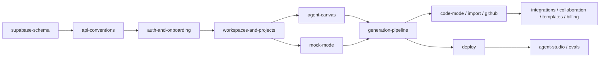

# Architect 2.0 — Implementation Specs

Derived from `docs/engineering/engineering-doc.md` (authoritative). Each spec is self-contained. Design rules live in `docs/design-system.md`. Environment variables live in `/.env.example`.

## Index

| File | Specifies | Phase |
|---|---|---|
| `supabase-schema.sql` | Complete database: extensions, enums, tables, indexes, triggers, RPCs, RLS, Realtime, storage buckets | 0 |
| `seed.sql` | Demo data for the prototype (Support Copilot project, runs, templates) | 0 |
| `api-conventions.md` | Request pipeline, error envelope, authorization matrix, pagination, idempotency, rate limits, Realtime channels | 0 |
| `frontend-architecture.md` | Routes, layouts, providers, state, data fetching, UX states, component inventory | 0 |
| `auth-and-onboarding.md` | Sign-up/in (email+OTP, Google, GitHub), session middleware, onboarding wizard, invitations | 0 |
| `workspaces-and-projects.md` | Workspace shell, dashboard, project CRUD, search/filter, soft delete, members | 0 |
| `agent-canvas.md` | Agent graph data model, canvas UI, agent/edge/tool APIs, inspector, entry/locks | 0 |
| `mock-mode.md` | `MOCK_MODE` service swapping, fixtures, timed Realtime simulation | 0 |
| `generation-pipeline.md` | Clarify → PRD → graph → estimate → build → preview → edits → checkpoints → visual edits | 1 |
| `ai-platform.md` | LLM gateway, routing, prompts, structured output, context budgets, cost controls | 1 |
| `framework-adapters.md` | Adapter interface, Agent Protocol, managed regions, canvas↔code sync | 1 |
| `code-mode-and-cli.md` | IDE layout, file APIs, terminal, diff review, coding agent, parallel tasks, CLI | 1–2 |
| `import.md` | GitHub/zip import, detection, report, finalize | 1–2 |
| `github.md` | GitHub App, repo connect, auto-commit, sync, PRs, webhooks, conflicts | 1–2 |
| `deploy.md` | Preflight, deploy pipeline, environments, secrets, domains, rollback | 1 |
| `evals.md` | Eval sets, scorers, runs, deploy gate | 2 |
| `agent-studio.md` | Overview, runs/traces, guardrails, approvals (HITL), alerts, ingest | 1–2 |
| `integrations-and-mcp.md` | Connector catalog, OAuth via Nango, API keys, MCP servers, agent tools | 2 |
| `collaboration.md` | Invites, roles, comments, presence, notifications, activity | 2 |
| `templates.md` | Template model, gallery, instantiate flow, official templates | 2 |
| `billing-and-credits.md` | Plans, Stripe, credits reserve/settle, usage, spend caps | 1–2 |
| `security.md` | Threat model, controls, secrets handling, sandbox isolation, audit | 0–2 |
| `infrastructure.md` | Services, jobs, sandboxes, runtime hosting, CI/CD, environments | 1 |
| `testing.md` | Test layers, tools, fixtures, required suites per spec | 0–2 |

## Execution order

Phase 0 (prototype) = schema, conventions, frontend architecture, auth/onboarding, workspaces/projects, canvas, mock mode. Everything else renders through mock services with identical API contracts.
