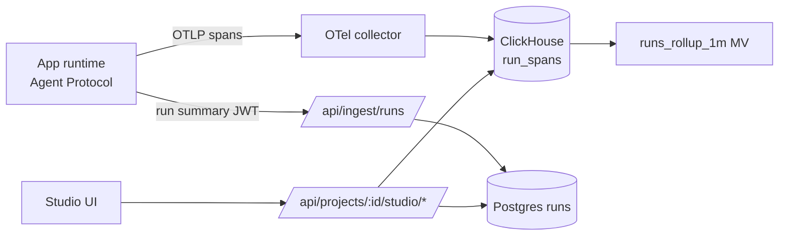

# Spec — Agent Studio

PRD Flow 8 (§13) · FR-26, FR-27 · Engineering doc §4.9, §8.10 · Phase 1 (overview, runs, traces, agents, guardrails) · Phase 2 (HITL, alerts, feedback)

## 1. Data flow



ClickHouse DDL (`infra/clickhouse/`):

```sql
CREATE TABLE run_spans (project_id UUID, run_id UUID, span_id String, parent_id String, name LowCardinality(String), agent_key LowCardinality(String),
  start DateTime64(3), end DateTime64(3), status LowCardinality(String), attrs Map(String,String), input String, output String, tokens_in UInt32, tokens_out UInt32, cost Float64)
ENGINE = MergeTree PARTITION BY toYYYYMM(start) ORDER BY (project_id, run_id, start) TTL toDateTime(start) + INTERVAL 90 DAY;
CREATE MATERIALIZED VIEW runs_rollup_1m ENGINE = SummingMergeTree ORDER BY (project_id, env, minute) AS
SELECT project_id, attrs['architect.env'] AS env, toStartOfMinute(start) AS minute, count() AS runs, countIf(status='error') AS errors,
  sum(cost) AS cost, quantileState(0.95)(dateDiff('millisecond', start, end)) AS p95 FROM run_spans WHERE parent_id = '' GROUP BY project_id, env, minute;
```

Phase 0: Studio reads from Postgres `runs` (seeded) and computes aggregates in SQL.

## 2. API

| Method | Path | Action | Params / body | Response |
|---|---|---|---|---|
| GET | `/api/projects/{id}/studio/overview` | project:read | `environment=production`, `range=24h|7d|30d` | `{ kpis: { runs, successRate, p95LatencyMs, costToday, costMonth, escalations }, series: [{ ts, runs, errors, cost }], topErrors: [{ message, count }] }` |
| GET | `/api/projects/{id}/studio/runs` | project:read | `status?`, `agentId?`, `q?` (≤ 100), `from?`, `to?` (≤ 90 d), `cursor` | `{ items: [{ id, createdAt, status, entryAgent, latencyMs, cost, inputPreview, outputPreview, endUserRef }], nextCursor }` |
| GET | `/api/runs/{runId}` | project:read | — | `{ run, spans: [{ id, parentId, name, agentKey, start, end, status, attrs, input, output, tokensIn, tokensOut, cost }] }` |
| POST | `/api/runs/{runId}/replay` | prompt:write | `{ commitSha? }` | 202 `{ testRunId }` |
| POST | `/api/runs/{runId}/feedback` | public key of app (end user) | `{ value: -1|1, comment? ≤ 1000 }` | 204 |
| GET | `/api/projects/{id}/studio/agents` | project:read | `range` | `{ items: [{ agentId, key, name, model, runtimeStatus, runs, successRate, avgCost, errorRate }] }` |
| PATCH | `/api/projects/{id}/agents/{agentId}/runtime` | deploy:production | `{ environment, runtimeStatus?: 'active'|'paused', model? }` | `{ agent }` → pushes `PUT /config` |
| GET | `/api/projects/{id}/guardrails` | project:read | — | `{ items: Guardrail[] }` |
| POST | `/api/projects/{id}/guardrails` | guardrails:write | `{ type, agentId?, config }` | 201 |
| PATCH | `/api/guardrails/{id}` | guardrails:write | `{ enabled?, config? }` | `{ guardrail }` → hot reload |
| GET | `/api/projects/{id}/guardrails/violations` | project:read | `cursor` | `{ items, nextCursor }` |
| GET | `/api/projects/{id}/approvals` | project:read | `status=pending` | `{ items: [{ id, runId, agent, payload, assignedTo, expiresAt, createdAt }] }` |
| POST | `/api/approvals/{id}/decision` | approvals:decide | `{ decision: 'approve'|'reject', editedPayload?, note? ≤ 1000 }` | `{ approval }` → runtime `POST /resume/{runId}` |
| GET/POST | `/api/projects/{id}/alerts` · PATCH/DELETE `/api/alerts/{id}` | alerts:write | `{ metric, operator, threshold, windowMin 1–1440, channels: { email?: string[] ≤ 10, slackWebhook?: https URL, webhook?: https URL }, enabled }` | `{ rule }` |
| POST | `/api/ingest/runs` | service JWT (`aud: ingest`) | `{ runs: RunSummary[] ≤ 500 }` | 202 |
| POST | `/api/ingest/approvals` | service JWT | `{ runId, projectId, agentKey, payload }` | 201 |

Guardrail config schemas: `pii_redaction { entities: ('EMAIL'|'PHONE'|'CREDIT_CARD'|'SSN'|'IP')[] }`, `blocked_topics { topics: string[] ≤ 20 }`, `spend_limit { perRunUsd, perDayUsd }`, `output_schema { schema: JSONSchema }`, `jailbreak_detection { threshold: 0–1 }`, `allowed_tools { tools: string[] }`.

## 3. UI (Studio tab and `/w/[ws]/studio` across projects)

- **Overview:** environment select, range select; KPI tiles (Runs, Success rate, P95 latency, Cost today, Cost this month, Escalations) with delta vs previous period; line chart runs + errors; bar chart cost/day; Top errors list.
- **Runs:** filter bar (status, agent, search, date range), table (virtualized), row → **Trace drawer**: timeline (nested spans as horizontal bars colored by agent), step list with input/output (Build mode shows plain-language story: "Triage sent this to Escalation because sentiment was −0.8"), tokens/cost/latency; actions Replay, Add to eval set, Copy link.
- **Agents:** table + live canvas colored by error rate (green < 2%, amber < 10%, red ≥ 10%); pause/resume, change model.
- **Guardrails:** cards per type with switch, config form, violations count (24 h); violations log table.
- **Approvals:** queue list with payload preview, Approve / Edit & approve / Reject, expiry countdown.
- **Alerts:** rules table + create dialog; recent alert events.
- Empty state (no deploys): "Deploy your app to see live runs" + Deploy button.

## 4. Acceptance criteria

- [ ] Production runs appear in Runs within 10 s of completion.
- [ ] Trace view shows every agent step and tool call with tokens and cost.
- [ ] Toggling a guardrail changes runtime behaviour without redeploy (verified by e2e fixture).
- [ ] Approval decision resumes the paused run; expired approvals auto-reject after 72 h.
- [ ] Alert fires within 2 min of threshold breach to email/Slack/webhook.
