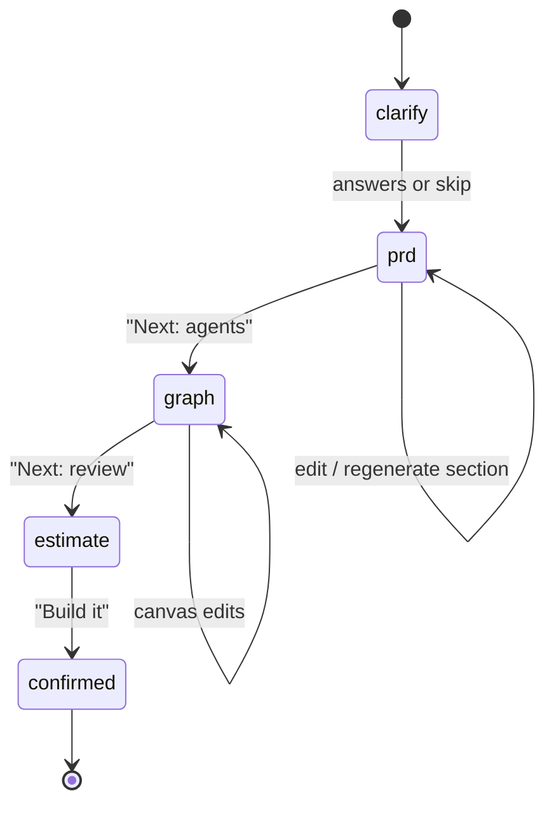

# Spec — Generation Pipeline (Prompt → Agentic App)

PRD Flow 2 (§7) · FR-04 → FR-11 · Engineering doc §4.3, §8.2–8.7 · Phase 1 (Phase 0 via `mock-mode.md`)

## 1. Stages and state machine



`generation_sessions.stage` stores the stage. Endpoints reject calls for the wrong stage with 409 `CONFLICT` (`details.expectedStage`). Going back (e.g. graph → PRD edit) is allowed; the session stays at the furthest stage reached.

## 2. Contracts (`lib/contracts/generation.ts`)

```ts
export const ClarifyRequest = z.object({
  prompt: z.string().trim().min(1).max(10000),
  attachments: z.array(z.string().regex(/^[0-9a-f-]{36}\/.+$/)).max(10).default([]),  // storage paths in project-attachments
  figmaUrl: z.string().url().regex(/^https:\/\/(www\.)?figma\.com\//).optional(),
})
export const ClarifyQuestion = z.object({
  id: z.string().regex(/^q[1-5]$/), text: z.string().max(200),
  options: z.array(z.string().max(60)).max(6).default([]), multi: z.boolean().default(false),
})
export const ClarifyResponse = z.object({ sessionId: z.string().uuid(), questions: z.array(ClarifyQuestion).min(2).max(5) })

export const PrdSection = z.object({ key: z.enum(['overview','users','goals','features','agents','integrations','data','ui','non_functional']), title: z.string(), bodyMd: z.string().max(8000) })
export const PrdContent = z.object({ title: z.string().max(120), summary: z.string().max(600), sections: z.array(PrdSection).min(5) })
export const PrdRequest = z.object({ sessionId: z.string().uuid(), answers: z.record(z.union([z.string().max(500), z.array(z.string().max(60)).max(6)])).default({}), skip: z.boolean().default(false) })

export const Estimate = z.object({
  credits: z.object({ p50: z.number().nonnegative(), p90: z.number().nonnegative() }),
  minutes: z.object({ p50: z.number().positive() }),
  breakdown: z.array(z.object({ item: z.string(), credits: z.number() })),
  missingIntegrations: z.array(z.string()),
})
export const StartBuildRequest = z.object({ sessionId: z.string().uuid().optional(), kind: z.enum(['initial','rebuild','scaffold_only']).default('initial') })
export const BuildEvent = z.object({
  seq: z.number().int(), type: z.enum(['step_started','step_done','log','file_written','test_result','autofix','error','done']),
  stepKey: z.enum(['schema','agents','tools','ui','tests','preview']).nullable(), payload: z.record(z.unknown()), createdAt: z.string(),
})
export const EditRequest = z.object({
  mode: z.enum(['plan','build']), channel: z.enum(['chat','code_agent']),
  message: z.string().trim().min(1).max(10000), context: z.array(z.string().max(300)).max(20).default([]),
})
export const VisualEditRequest = z.object({
  archId: z.string().regex(/^[a-z0-9-]{6,40}$/),
  changes: z.object({ text: z.string().max(2000).optional(), className: z.string().max(500).optional(), style: z.record(z.string().max(100)).optional() })
    .refine(v => Object.keys(v).length > 0),
})
```

## 3. API

| Method | Path | Action | Response | Errors |
|---|---|---|---|---|
| POST | `/api/uploads/sign` | prompt:write | `{ uploadUrl, path }` (Supabase signed upload URL, 5 min) | 413, 422 (type) |
| POST | `/api/projects/{id}/generation/clarify` | prompt:write | `ClarifyResponse` | 402 |
| POST | `/api/projects/{id}/generation/prd` | prompt:write | `{ prd: { id, version, content: PrdContent } }` | 409 |
| PATCH | `/api/prds/{prdId}` | prompt:write | new version `{ prd }` | 422 |
| POST | `/api/prds/{prdId}/sections/{key}/regenerate` | prompt:write | `{ prd }` | 404, 402 |
| POST | `/api/projects/{id}/generation/agent-graph` | prompt:write | `AgentGraphDto` (replaces existing unmanaged-free graph; locked agents kept) | 409 |
| POST | `/api/projects/{id}/generation/estimate` | prompt:write | `Estimate` | 409 |
| POST | `/api/projects/{id}/builds` | prompt:write | 202 `{ buildId, realtimeChannel: 'build:<id>' }` | 409 `BUILD_RUNNING`, 402 |
| GET | `/api/builds/{buildId}` | project:read | `{ build, events: BuildEvent[] }` | 404 |
| POST | `/api/builds/{buildId}/cancel` | prompt:write | `{ build }` | 409 |
| POST | `/api/projects/{id}/edits` | prompt:write (+project:code for `code_agent`) | SSE events `plan`, `step`, `patch`, `summary`, `done`, `error` | 402, 423 |
| POST | `/api/edits/{editId}/apply` | prompt:write | `{ checkpoint }` | 409 |
| POST | `/api/edits/{editId}/reject` | prompt:write | `{ edit }` | 409 |
| POST | `/api/projects/{id}/visual-edits` | canvas:write | `{ checkpoint }` (0 credits) | 404, 423 |
| GET | `/api/projects/{id}/checkpoints` | project:read | `{ items, nextCursor }` | — |
| POST | `/api/checkpoints/{id}/restore` | prompt:write | `{ checkpoint }` | 409 (build running) |
| POST | `/api/projects/{id}/test-runs` | prompt:write | SSE `token`, `trace`, `done` | 503 |

Credit costs (charged via `billing-and-credits.md`): clarify 0.5, PRD 3, section regenerate 1, graph 3, build = actual tokens (reserved from estimate p90), edit plan 1, edit build = actual, visual edit 0, auto-fix retries 0.

## 4. Build job (`build.run`, Inngest)

Steps (each emits `step_started`/`step_done` and is retried independently, max 2 infra retries):
1. **provision** — get/wake sandbox for `(project, working_branch)`; timeout 60 s → `SANDBOX_UNAVAILABLE`.
2. **schema** — generate SQL migrations for the app's data model from PRD `data` section; apply to the app database (per `infrastructure.md` §4).
3. **agents** — framework adapter `scaffold()` + `render_agent()` per agent (see `framework-adapters.md`).
4. **tools** — bind built-in/integration/MCP tools; missing secrets emit `log` with `payload.missingSecret` (UI shows Connect banner; build continues with stub that raises a clear runtime error).
5. **ui** — Next.js pages from PRD `ui` section: chat console page for the entry agent, admin/inbox pages per PRD.
6. **tests** — run adapter smoke tests + `pnpm typecheck`; failures → auto-fix loop (≤ 3, free) → `autofix` events.
7. **preview** — start dev server, wait for HTTP 200 on `/` within 90 s, set `builds.preview_url`, `projects.preview_url`, `projects.status='preview'`, create checkpoint "Initial build", settle credits.

Failure after retries → `builds.status='failed'`, `error = { step, message, hint }`, reservation released minus tokens used for non-autofix steps; UI shows ErrorCard.

## 5. UI

- **PromptComposer** (chat panel bottom): textarea, attach (image/pdf/md/txt/csv/docx), Figma link, model picker (Code mode only), Plan/Build toggle, send (`Cmd/Ctrl+Enter`). Disabled while a build runs.
- **ClarifyChips**: each question as a card with option chips (single/multi) + free text; "Skip — use best guesses".
- **PRD tab**: `PrdEditor` sections with inline markdown editing (Tiptap), "Regenerate" per section, version selector, autosave → new version.
- **Confirm summary**: stack, agents count, integrations with Connect buttons, estimate (p50 credits, minutes) and balance after; primary "Build it"; Code mode secondary "Generate scaffold only".
- **BuildChecklist**: 6 steps with icons (pending/running/done/failed), expandable log in Code mode, cancel button.
- **Preview tab**: iframe (`sandbox="allow-scripts allow-same-origin allow-forms allow-popups"`), URL bar, device toggles (desktop 100%, tablet 834, mobile 390), refresh, open in new tab, "Select element" toggle → `ElementInspector`.
- **TestConsole** (drawer under preview): chat with the app's entry agent; each reply shows trace chips (agent → tool → agent) that expand to a mini timeline.
- **ChangeCard** in chat: summary, files changed count, credits used, "Restore", "View diff" (Code mode).

## 6. Edge cases

| Case | Behaviour |
|---|---|
| Second "Build it" while building | 409; UI disables button and links to running build |
| Browser closed mid-build | Build continues; reopening project shows live checklist from `build_events` replay |
| LLM returns invalid JSON | One repair retry; then 502 and credits released |
| Prompt references integration not connected | Estimate lists it; build continues with stub + banner |
| Visual edit on an element generated by a locked page | 423 |
| Restore during running build | 409 |

## 7. Acceptance criteria

- [ ] Clarify < 5 s P95; PRD and graph validate against schemas ≥ 99% on golden set.
- [ ] Template prompts build to a working preview in < 4 min P50 with ≥ 85% success.
- [ ] Every AI change creates a checkpoint that restores exactly.
- [ ] Visual edits never consume credits; auto-fix retries never billed.
- [ ] Build progress survives page reloads.
